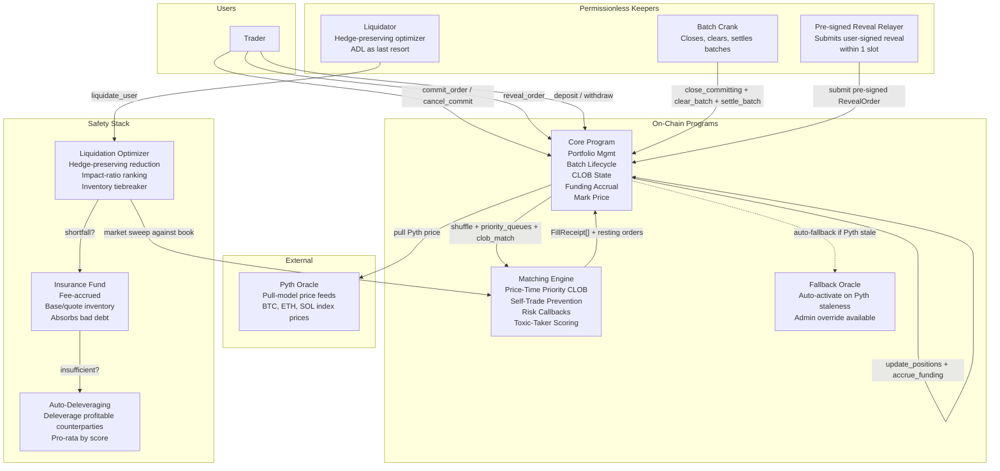

# Architecture — mgk Perps DEX

**Commit-reveal CLOB on Solana · Pinocchio / no_std · sequencer-free · MEV-mitigated**

Repository: https://github.com/mangekyou-labs/mgk-solana
Devnet programs: perps-core, perps-matcher, oracle (all executable — see [Verify](#how-to-verify))
Design source of truth: `docs/ai/design/feature-onchain-perps-dex.md`

---

## Introduction

### High-Level Overview

Perpetual futures are the largest category in DeFi by trading volume. On-chain perps today force a trade-off: fast but trust an off-chain sequencer (Drift, Mango, Zeta), or permissionless but AMM-capped with no resting depth (Jupiter Perps, Perpetual Protocol). **mgk takes a third path** — a fully on-chain commit-reveal CLOB with no sequencer, no AMM curve, and persistent GTC resting depth.

Every order, fill, liquidation, and settlement is verifiable on-chain. MEV is mitigated through sealed commitments: orders are committed as hashes during a commit phase, revealed after the commit phase closes, shuffled deterministically by the close slot, separated into structural priority queues (cancels → post-only/ALO → regular), then matched against the resting book with price-time priority.

**Mission:** Sequencer-free, on-chain execution as a reusable primitive for Solana DeFi. The CLOB is the architecture — trading prices emerge from two-sided orderbook flow between competing participants, not from an external feed.

**Initial launch parameters:**

- Single collateral: SOL
- Three planned markets: SOL-PERP, BTC-PERP, ETH-PERP
- Cross-margin portfolio per wallet
- 5–20x leverage range with per-instrument caps
- Batch latency: ~2–4s p50, <8s p99 (short-batch commit-reveal)

**Competitive advantages:**

- **No sequencer trust assumption:** all matching, settlement, and liquidation execute on-chain via Pinocchio BPF programs
- **MEV-mitigated:** commit-reveal hides order contents from the mempool; Fisher-Yates shuffle eliminates time-advantage; structural priority queues guarantee fairness
- **Persistent GTC depth:** resting orders survive across batches — capital accumulates, makers earn rebates
- **Pinocchio, not Anchor:** `no_std`, zero-allocation, single-byte discriminators, checked arithmetic throughout — no IDL overhead, minimal SBF binary footprint
- **Sequencer-free execution pattern** is transferable as a primitive to other Solana venues (options, structured products)

---

## High-Level Architecture

The protocol consists of four interconnected systems:



**Key architectural principle:** The Core Program is the **single custody authority**. All SOL collateral lives in Core-controlled vaults/PDA portfolios. The Matching Engine holds the order book state but never holds funds. This follows the Solana authority-isolation pattern: only one program can move user funds, reducing the blast radius of any bug in the matching logic.

**Fair ordering principle:** 4-layer fair ordering — (1) commit-reveal as MEV protection, (2) deterministic Fisher-Yates shuffle seeded by close_slot, (3) structural priority queues (cancels → post-only/ALO → regular), (4) price-time priority CLOB. The fair-ordering and safety-stack designs follow [Bulk.Trade](https://docs.bulk.trade); commit-reveal substitutes for Bulk.Trade's BULKBFT quorum admission, which cannot be replicated on-chain.

**Safety stack principle:** liquidation optimizer (hedge-preserving, impact-ratio ranked) → insurance fund → auto-deleveraging (ADL). The optimizer selectively reduces positions that contribute most to portfolio risk while preserving hedges. ADL deleverages profitable counterparties as a last resort.

### Why Not FIFO

FIFO creates time-based advantages for colocated participants who submit faster. mgk's deterministic shuffle eliminates time-based priority within a batch:

| FIFO Weakness | Shuffle + Priority Queue Fix |
|---|---|
| Time advantage for colocated/fast participants | Shuffle randomizes within batch — submission time irrelevant |
| No guarantee cancels execute before fills | Cancels always execute before all order types (structural priority) |
| No guarantee makers seed book before takers cross | Post-only/ALO orders execute before regular orders (structural priority) |
| Sort key grinding possible even with protocol_nonce | Shuffle seed = `close_slot` (consensus output) — no grinding vector |

---

## Component Responsibilities

### Smart Contracts Layer (Pinocchio / Rust / no_std)

- Stores all position, batch, commitment, and order-book state in PDAs
- Executes fund transfers with atomic guarantees inside Core
- Enforces risk parameters and liquidation logic
- Calculates PnL, funding rates, and mark prices
- Manages resting order lifecycle (place / cancel / modify)
- Integrates Pyth pull oracle + admin fallback

### Backend Services (Node.js — see `mgk-frontend/apps/indexer/`)

- Indexes on-chain events (log subscriptions) into PostgreSQL
- REST API + WebSocket server for frontend queries
- Permissionless keepers: batch crank, liquidator, pre-signed reveal relayer

### Oracle Integration

- **Primary:** Pyth Network pull-model price feeds (BTC/USD, ETH/USD, SOL/USD) read directly by Core via `pyth-solana-receiver-sdk`
- **Fallback:** minimal on-chain admin-pushed price feed (auto-activates on Pyth staleness)

### Frontend Application (React / Next.js 15 / Tailwind)

- TradingView chart, order book, order form, position panel
- Wallet connect (Phantom, Solflare)
- SDK package ships instruction encoders, PDA derivation, and state decoders (see `mgk-frontend/packages/sdk/`)

---

## Smart Contracts

### Program Architecture

Three on-chain programs + one shared library crate, all Pinocchio (`pinocchio::entrypoint!()`), no Anchor:

| Program | Role | Devnet ID |
|---|---|---|
| `mgk-perps-core` | Portfolio mgmt, batch lifecycle, custody, mark price | `3jYQ4mpWBBtwrzYQ4zzKhgqVcWWsG2HpXi9oXTBpekja` |
| `mgk-perps-matcher` | Price-time priority CLOB matching, shuffle, priority queues | `AU4EKQAQupEbMWPK9fuJA7CZqfcjM5Bpgf6Ew9Y7o2FF` |
| `percolator-oracle` | Fallback price feed (admin-pushed, auto-activate) | `6M9eEiDKy8imbDi44ZqquyfknNbveRjD4j9VnvYaHtmA` |
| `percolator-common` | Shared account validation, errors, math (library crate) | — |

### Program Descriptions

**mgk-perps-core** is the sole custody authority and batch lifecycle coordinator. It owns portfolio state, the commitment registry, the collateral vault, the CLOB state accounts, and the mark-price computation. It owns the four-phase batch lifecycle (commit → reveal → clear → settle) and issues one-way CPI to the matcher during `clear_batch`. This program changes most often as new features are added — which is why fund custody is isolated from the matching engine.

Key instructions (single-byte discriminator, not Anchor's 8-byte SHA256 digest):

| Disc | Instruction | Auth | Description |
|---|---|---|---|
| `0x00` | `Initialize` | Governance | Bootstrap registry |
| `0x01` | `InitPortfolio` | User signer | Create per-user cross-margin account |
| `0x02` | `Deposit` | User signer | Deposit SOL into portfolio vault |
| `0x03` | `Withdraw` | User signer | Withdraw SOL with margin check |
| `0x04` | `CommitOrder` | User signer | Submit hashed order + deposit |
| `0x05` | `RevealOrder` | User signer | Reveal order params + salt (relayer-compatible via pre-signed tx) |
| `0x06` | `CloseCommitting` | Permissionless | Close commit phase once dynamic criteria met |
| `0x07` | `ClearBatch` | Permissionless (crank) | Shuffle + priority queues + CLOB match via CPI |
| `0x08` | `SettleBatch` | Permissionless | Return deposits, accrue funding, finalize |
| `0x09` | `LiquidateUser` | Permissionless (keeper) | Hedge-preserving optimizer → insurance → ADL |
| `0x0A` | `AddInstrument` | Governance | Register new perp market |
| `0x0B` | `CancelRestingOrder` | User signer | Cancel resting GTC order |
| `0x0C` | `ModifyRestingOrder` | User signer | Modify resting order qty |
| `0x0D` | `CancelAllRestingOrders` | User signer | Cancel all user resting orders |
| `0x0E` | `SetPauseFlags` | Governance | 4-flag emergency pause (trading / withdrawals / liquidations / funding) |
| `0x0F–0x13` | Bootstrap utilities | Governance / keeper | Solana 4.x PDA/account creation helpers |

**mgk-perps-matcher** is the matching engine. The design specifies one monolithic `ShuffleAndMatch` instruction; the shipped implementation decomposes it into 5 modular instructions for BPF stack safety (the 4 kB BPF stack frame cannot hold the full match in one call).

| Disc | Instruction | Description |
|---|---|---|
| `0x00` | `ComputeClearing` | Fisher-Yates shuffle + priority queue separation |
| `0x01` | `CancelResting` | Cancel resting order during clearing |
| `0x02` | `ModifyResting` | Modify resting order during clearing |
| `0x03` | `ClearAndMatch` | Full match flow (aggressive walk + passive rest) |
| `0x04` | `CancelAll` | Cancel-all for an account |

**Critical rule:** the matcher never calls Core, and never holds funds. Book state lives in matcher accounts but is rent-exempted by Core. The matcher is stateful: GTC orders persist as `OrderBook` PDA accounts across batches.

**percolator-oracle** is the fallback price feed. Same `PriceFeed` struct used by the primary Pyth path. Auto-activates when Pyth is stale, frozen, or has excessive confidence intervals. Admin can manually activate/deactivate.

| Disc | Instruction | Auth | Description |
|---|---|---|---|
| `0x00` | `Initialize` | Admin | Bootstrap instrument + initial price |
| `0x01` | `UpdatePrice` | Admin | Push new price + confidence |
| `0x02` | `SetAuthority` | Admin | Rotate admin key |
| `0x03` | `Activate` | Admin | Manually activate fallback |
| `0x04` | `Deactivate` | Admin | Manually deactivate fallback |

### Why This Architecture

- **Security:** fund custody (Core) is isolated from matching logic (Matcher). A bug in the matcher cannot directly move user funds.
- **Upgradability:** matching logic can be upgraded without touching the custody path.
- **Auditing:** smaller, focused programs are easier to audit thoroughly. ~5,900 LOC matcher is the largest; Core is comparable.
- **Risk isolation:** each safety-stack layer (optimizer → insurance → ADL) is independently reachable, so a partial failure doesn't cascade.
- **CPI direction is one-way:** Core → Matcher only. Matcher → Core is forbidden. Pyth is read-only (no CPI).

### CPI Relationships

```
Core  ──CPI──► Matching Engine  (clear_batch: revealed orders + close_slot + book → fills + book)
Core  ──READ──► Pyth accounts    (pull index price for funding + mark + liquidation)
Core  ──READ──► Fallback Oracle  (if Pyth stale / frozen)
Liquidator ──CALL──► Core        (liquidate_user → optimizer → market sweep)
Crank      ──CALL──► Core        (close_committing / clear_batch / settle_batch)
Relayer    ──CALL──► Core        (submit pre-signed RevealOrder)
```

### Data Storage Overview

All accounts are PDAs (Program Derived Addresses) with deterministic seeds. Sizes are rent-exempt class.

| PDA | Owning program | Seeds | Lifecycle | Write auth |
|---|---|---|---|---|
| `Registry` | core | `["registry"]` | Persistent (singleton) | Governance |
| `Instrument` | core | `["instrument", instrument_id]` | Persistent | Governance |
| `Portfolio` | core | `["portfolio", user_pubkey]` | Persistent | User / keeper (liquidation only) |
| `Vault` | core | `["vault"]` | Persistent (singleton) | Core (custody) |
| `Batch` | core | `["batch", batch_id]` | Per-batch (sequential) | Core |
| `Commitment` | core | `["commitment", batch_id, user, nonce]` | Per-batch | User (commit/reveal) → Core (slash) |
| `RevealedOrder` | core | (transient, in Batch CPI buffer) | Per-batch | Core |
| `OrderBook` | matcher | `["book", instrument_id]` | Persistent across batches | Matcher (via Core CPI) |
| `RestingOrder` | matcher | (in OrderBook BSS scratch) | Persistent until cancelled | Matcher |
| `FallbackPrice` | oracle | `["fallback", instrument_id]` | Persistent | Admin |
| `FlowQualityScore` | core | `["flow_quality", address, instrument_id]` | Persistent, rolling 100-batch window | Core (settle) |
| `PauseFlags` | core | (in Registry) | Persistent | Governance |

**Matcher BSS scratch buffers:** the matcher writes link-section scratch buffers in `.data.S` so order book mutations stay within the 4 kB BPF stack frame. This is a Solana-specific workaround for stack-overflow errors that Anchor-style allocations would hit. See `programs/perps-matcher/src/state/clob.rs` and `book.rs`.

### Order Types

| Type | Behavior |
|---|---|
| `Limit(GTC)` | Rests on book if not immediately fillable. Persistent across batches. |
| `Limit(IOC)` | Fills what's available; remainder cancelled. Never rests. |
| `Limit(ALO)` | Add-Liquidity-Only. Rejected (`rejectedCrossing`) if it would take liquidity. Otherwise rests. |
| `Market` | Walks the book until filled or book exhausted. Risk callback per fill. |
| `Cancel` | Cancel one resting order by ID. Structurally prioritized before all order types. |
| `CancelAll` | Cancel all resting orders for the user. Structurally prioritized. |

---

## Batch Lifecycle

A trading **batch** is the fundamental clearing epoch. The CLOB persists across batches — resting orders survive between clearing cycles.

```
                     close_committing              clear_batch                         settle_batch
                     records close_slot            1. Fisher-Yates shuffle
                          |                       2. Priority queue separation
                          |                       3. CLOB match: cancels, ALO, regular
                          |                       4. Resting orders stay on book
   ┌──────────────┐  ▼  ┌──────────────┐  ▼  ┌──────────────┐  ▼  ┌──────────────┐
   │  COMMITTING  │──►│  REVEALING  │──►│   CLEARING  │──►│   SETTLED   │
   │ Users submit  │    │ Users reveal │    │ Shuffle +   │    │ Positions    │
   │ hashed orders │    │ order params │    │ priority    │    │ updated.     │
   │ + deposits    │    │ + salts      │    │ queues +    │    │ Deposits back │
   │ + cancels     │    │ + order type │    │ CLOB match  │    │ Funding       │
   └──────────────┘    └──────────────┘    └──────────────┘    └──────────────┘
```

### Phase 1: Committing

Users submit `hash(order_type, side, price, qty, salt, user_pubkey, batch_id)` to Core. A commitment deposit is locked, dynamic and risk-based: `base_deposit * volatility_multiplier[instrument]`. Cancel commitments reference a resting order ID and need no deposit.

Phase closes when dynamic criteria are met: `N_commitments >= N_min AND slot_age >= T_min` OR `slot_age >= T_max`. Any permissionless crank can call `CloseCommitting` once criteria are satisfied.

### Phase 2: Revealing

Users reveal `order_type, side, price, qty, salt, reduce_only`. Core verifies the hash matches the stored commitment. Reveal deadline is `T_reveal` slots after the commit phase closed. **Users who do not reveal are fully slashed** — the entire commitment deposit is credited to the insurance fund, and the order is excluded from the batch.

**Pre-signed reveal relayer (short-batch mode):** the user signs `CommitOrder` and `RevealOrder` in one wallet action, hands the pre-signed reveal transaction to a permissionless relayer bot, and the relayer submits the reveal within 1 slot of commit confirmation. This eliminates slash risk from tight reveal windows when batches close in ~2–4s.

### Phase 3: Clearing

1. **Shuffle** — Fisher-Yates of all revealed orders, seeded by `close_slot`. Randomizes order within the batch; submission timing becomes irrelevant.
2. **Priority queue separation** — cancels execute first; post-only/ALO second; regular orders third.
3. **CLOB matching** — within each queue, process orders in shuffled order:
   - Aggressive orders walk the book; each fill at the resting (maker) order's limit price.
   - Risk callback after every fill: if the resulting position would breach margin, cancel the remainder.
   - Passive orders rest on the book as GTC.
   - ALO orders that would cross are rejected (`rejectedCrossing`); otherwise they rest.
   - IOC orders fill what's available; remainder cancelled.
4. **Resting orders persist** — unmatched GTC orders remain on the book for future batches.

### Phase 4: Settled

- Commitment deposits returned to filled users (net of trading fees)
- Maker rebates applied (maker_fee_bps is typically negative — rebate)
- Slashed deposits from non-revealers credited to insurance fund
- Funding accrual: mark price computed per instrument; `cum_funding` updated; funding payments applied to portfolios with positions
- Next batch opens; book state carries over

### Dynamic Batch Cadence

| Parameter | Purpose | Long-batch default | Short-batch target |
|---|---|---|---|
| `N_min` | Min commitments for early close | 5 | 5 |
| `T_min` | Min slot age before early close | 10 | 2 (~0.8s) |
| `T_max` | Max slot age before forced close | 150 | 15 (~6s) |
| `T_reveal` | Reveal phase duration | 25 | 3 (~1.2s) |

Short-batch params are governance-configurable — **no on-chain program changes required** for the latency reduction.

---

## Oracle Integration

**Design principle:** trading prices emerge from two-sided orderbook flow. The oracle is a reference anchor for funding rate, mark price stabilization, and liquidation risk — **never** the execution price.

### Price Sources (defense in depth)

| Layer | Source | Role | Trigger |
|---|---|---|---|
| 1 (primary) | Pyth Network pull oracle | Index price for funding, mark price component, liquidation marking | Read inline when Core needs a price |
| 2 (fallback) | On-chain admin-pushed feed | Conservative fallback if Pyth stale/frozen | Auto-activate on staleness OR admin |

### Price Validation

- Pyth freshness: per-instrument `max_staleness_slots` (default ~25 slots / ~10s)
- Confidence interval check: reject prices with confidence > threshold
- Trading-status check: reject if Pyth flags the feed as halted
- Conservative pricing for liquidation: use unfavorable price (longs liquidated at low bid; shorts at high ask)

---

## Core Mechanisms

### Mark Price

The mark price reflects executable prices, not just top-of-book. The primary input is the **depth-weighted book mid**; the oracle is a fallback when the book is stale or thin.

```
P_bid  = sweep(sell, reference_notional)   // worst price to sell reference_notional
P_ask  = sweep(buy,  reference_notional)   // worst price to buy  reference_notional
P_book = (P_bid + P_ask) / 2
```

`reference_notional` is a configurable per-instrument amount (e.g., $10K). Accounts for actual liquidity at meaningful size, not just top-of-book.

When the book is stale (no updates for `book_staleness_threshold` slots) or has insufficient depth, the mark price smoothly transitions to the oracle:

```
age = (current_slot - book_last_update_slot) / decay_window_slots

if age >= 1.0:
    bias = tanh((age - 0.5) * 10) * 0.5 + 0.5    // sigmoid toward oracle
    P_mark = (1 - bias) * P_book + bias * P_oracle
else:
    P_mark = P_book
```

Smooth degradation, not a binary switch — prevents liquidation cascades from a stale-price spike.

### Funding Rate

Premium is computed from depth-weighted bid/ask vs oracle:

```
P_bid      = sweep(sell, sample_notional)
P_ask      = sweep(buy,  sample_notional)
P_oracle   = oracle_index_price
delta      = max(P_bid - P_oracle, 0) - max(P_oracle - P_ask, 0)
premium    = delta / P_oracle

F = clamp(SMA(premium_samples) + clamp(interest_rate - SMA(premium_samples), -deviation_cap, deviation_cap),
         -funding_cap, funding_cap)
```

| Param | Default |
|---|---|
| `interest_rate` | 1 bps |
| `deviation_cap` | 5 bps |
| `funding_cap` | 50 bps |
| `sample_notional` | 10,000 USD |

**Accrual:** `cum_funding += funding_rate * funding_period`, applied during `settle_batch` — no separate keeper instruction required.

**Application:** `funding_payment = position.qty * (cum_funding_current - position.last_funding_checkpoint)`. Longs pay shorts when `F > 0` (mark > index); shorts pay longs when `F < 0`.

### Liquidation & Safety Stack

**Trigger:** `Equity < M_p AND Position PnL < 0` where `M_p` is portfolio maintenance margin.

**Step 1 — Cancel open orders:** all resting orders across every market are cancelled to prevent exposure increase during liquidation.

**Step 2 — Compute target:** `target = max(0, Equity * (1 - buffer))`; `gap = M_p - target`. Buffer = 10% safety margin.

**Step 3 — Selective reduction:** for each non-zero position, compute margin impact of reducing it. **Skip positions where closing would NOT reduce portfolio margin** (these are hedges). Rank remaining positions by:

```
IR = margin_reduction / estimated_market_impact
```

`estimated_market_impact` comes from order book depth at the reduction size. Highest IR is reduced first. **Inventory tiebreaker:** when two positions have the same IR, prefer the reduction that moves insurance fund inventory toward target balance (e.g., 50/50 base/quote). IR remains the primary ranking signal — inventory is a soft tiebreaker only.

Reduction fraction by urgency:

| Condition | Reduction fraction |
|---|---|
| `gap > 30%` of `M_p` | 25% of position |
| `gap > 10%` of `M_p` | 10% of position |
| `gap ≤ 10%` of `M_p` | 5% of position |

**Step 4 — Iterate:** apply best reduction, recompute `gap`, repeat. Up to 10 iterations. If optimizer cannot resolve — **full flat** of all positions.

**Step 5 — Execute via market sweep:** planned reductions become market orders against the book. Per-fill risk checks prevent the liquidating account's margin from going further negative.

### Insurance Fund

If liquidation produces a shortfall (losses exceed account collateral), the insurance fund absorbs the bad debt. **No liquidation fee is charged to traders** — the fund is the backstop, replenished by slashed commitment deposits and protocol fees.

The fund tracks its own base/quote inventory separately (`insurance_base_reserves` and `insurance_quote_reserves` in the `Vault` struct) so the liquidation optimizer can prefer rebalancing sweep directions. Without inventory tracking, repeated liquidations in one direction can leave the fund one-sided. The rebalancing tiebreaker keeps the fund diversified without manual intervention.

### Auto-Deleveraging (ADL)

ADL activates when (a) the insurance fund cannot cover the shortfall, OR (b) there is unfilled liquidation volume (insufficient book liquidity).

**Ranking:** profitable counterparties on the opposite side ranked by:

```
score = max(1, PnL)^w * leverage^(1-w)
```

`w` is a configurable bias parameter (default 0.5). Highest-PnL + highest-leverage counterparties are deleveraged first.

**Allocation:** `ADL_size_i = total_shortfall * (score_i / sum(scores))`, closed at the deleveraged trader's entry price.

### Full Safety Stack

```
Margin breach detected
  → Liquidation Optimizer (hedge-preserving, IR-ranked)
    → Market sweep against book
      → Shortfall?
        → No:  Done
        → Yes: Insurance Fund absorbs loss
          → Fund sufficient?
            → Yes: Done
            → No:  ADL — deleverage profitable counterparties
```

### Toxic-Taker Detection

The matcher maintains a per-address, per-instrument flow-quality score computed from historical PnL-to-protocol over a rolling window (default 100 batches):

```
score = sum(PnL_to_protocol[address, instrument] over last N batches) / N

where PnL_to_protocol = maker_rebates − taker_fees − funding_payments for all fills by this address
```

- `score > 0`: benign taker (net payer to protocol)
- `score ≤ 0`: toxic taker (net drainer)
- Threshold configurable via governance

**Matcher behavior:** spread multiplied by `max(1.0, 1.0 + |score|/threshold)` capped at max; alternatively top-of-book depth withheld (taker sees level 2).

**Crucially: the taker is never hard-rejected.** The effect is economic friction, not exclusion. The protocol always provides a valid fill path; it just prices adversarial flow differently. Per-instrument scoring: toxic on SOL-PERP does not affect BTC-PERP score.

### Emergency Pause (4 independent flags)

| Flag | Effect |
|---|---|
| `PAUSE_TRADING` | Blocks `CommitOrder` |
| `PAUSE_WITHDRAWALS` | Blocks `Withdraw` |
| `PAUSE_LIQUIDATIONS` | Blocks `LiquidateUser` |
| `PAUSE_FUNDING` | Skips funding accrual in `SettleBatch` |

Gates verified in `commit_order`, `reveal_order`, `withdraw`, `liquidate_user`, and `settle_batch`. Each flag is independently settable via `SetPauseFlags` (governance only).

---

## Keepers (Permissionless Off-Chain Agents)

| Keeper | Operation | Revenue |
|---|---|---|
| **Batch Crank** | `CloseCommitting` → `ClearBatch` → `SettleBatch` | ~10% of batch taker fees |
| **Liquidator** | Monitor portfolio health; `LiquidateUser` → optimizer → market sweep | ~2.5% of liquidated notional |
| **Reveal Relayer (short-batch)** | Submit pre-signed reveal within 1 slot of commit confirmation | Small relayer fee deducted from commitment deposit return |

All keepers are permissionless. Anyone can run one. The protocol is safe under single-keeper operation (degraded) and improves with multiple competing keepers.

---

## Backend

### Indexer Service (`mgk-frontend/apps/indexer/`)

Node.js + TypeScript. Subscribes to on-chain logs via RPC, parses events into PostgreSQL, exposes REST + WebSocket.

- Real-time event sync to Postgres
- Backfill on startup
- REST endpoints for portfolio, batch, book, fills, instruments, oracle, flow-quality
- WebSocket for live book / batch updates

### API Server

Low-latency read endpoints cached in memory. Frontend polls REST; WebSocket pushes book deltas.

### Keeper Bots

| Keeper | Stack | Run mode |
|---|---|---|
| Batch Crank | Node.js / TypeScript | 24/7 devnet + mainnet |
| Liquidator | Node.js / TypeScript | 24/7 devnet + mainnet |
| Reveal relayer | Node.js, ~100 LOC | 24/7, triggered by commit confirmation |

### Keeper Economics

- Liquidation rewards cover execution costs + profit margin
- Batch crank is effectively subsidized by taker fees (anyone is incentivized to step in)
- Multiple competing keepers maintain redundancy and honesty

---

## Infrastructure Considerations

### Current (devnet)

- Single-region keeper VPS
- Postgres (single instance) for indexer
- Next.js 15 frontend on Vercel
- GitHub Actions CI: `cargo test --all-features` + `cargo clippy --all-targets --all-features -- -D warnings` + `cargo build-sbf` + `pnpm -r test` + Playwright E2E

### Planned (mainnet)

- Multi-region keeper VPS (US, EU, Asia) for redundancy
- Postgres read replicas for geographic distribution
- In-memory cache (Redis) for hot endpoints
- Grafana + Prometheus monitoring on keepers and indexer
- Rolling deployments via Docker

### Design Principles

- **Vendor-agnostic:** all services containerized with Docker; no cloud-specific dependencies
- **Horizontal scalability:** stateless API servers behind load balancer; DB read replicas
- **CI/CD:** GitHub Actions pipeline runs all test suites before deploy
- **Frontend:** Vercel CDN with IPFS backup

---

## Risk Disclosure & Compliance

### Technical Risks

| Risk | Mitigation |
|---|---|
| **Smart-contract bug** | Pinocchio (no Anchor macro magic), checked arithmetic throughout, single custody authority isolation, Kani formal verification (10 math proofs + 6 system invariants planned), independent security review before mainnet |
| **Oracle staleness / manipulation** | Pyth pull + admin fallback; freshness threshold + confidence check; graceful degradation to depth-weighted book mid when oracle is stale |
| **Commit-reveal slash risk** | Pre-signed reveal relayer eliminates user-side slash risk from tight reveal windows; relayer fee aligns incentives |
| **BPF stack overflow** | Matcher BSS scratch buffers in `.data.S` link section; modular instruction decomposition (`ComputeClearing` / `ClearAndMatch` / `CancelResting` etc.) |
| **Liquidation failure** | Permissionless liquidator + hedge-preserving optimizer + insurance fund + ADL; multi-keeper competition for liquidations |

### Market Risks

| Risk | Mitigation |
|---|---|
| **Toxic-taker gaming** | Flow-quality scoring over 100-batch rolling window; per-instrument scoring; capped spread widening (never hard-reject) |
| **Liquidity thinness** | Persistent GTC book across batches; depth-weighted mark price (not top-of-book); oracle as sanity anchor |
| **Funding rate gaming** | SMA over multiple samples per funding period; depth-weighted premium (not simple mid); funding cap |
| **Regulatory** | Initial launch markets are SOL-PERP, BTC-PERP, ETH-PERP — crypto-native. Geographic compliance handled at frontend (geo-block where required); program is network-agnostic |

### Operational Risks

| Risk | Mitigation |
|---|---|
| **Keeper liveness** | Permissionless + devnet-validated; multiple competing keepers; degraded-safe mode (mark price falls through to Pyth if oracle keepers fail) |
| **Key management** | Squads multisig (3-of-5 or similar) for upgrade authority, pause authority, governance in Phase 6 |
| **Program upgrade blast radius** | Pinocchio authority isolation — matcher can be upgraded without touching custody path |
| **Team risk** | Open-source ethos, full design doc + implementation report on disk, lifecycle-managed development |

---

## Operation Flows

### Example 1 — Open a long position via market order

**Setup:** Alice has deposited 5 SOL into her portfolio at SOL-PERP mark price $150.

1. Alice submits `CommitOrder(Limit(GTC), Long, $150, 2 SOL, salt, batch=N)` as a hash. A commitment deposit of ~0.01 SOL is locked.
2. Batch N commit phase closes after `T_min` slots with ≥5 commitments.
3. Alice (or her relayer) submits `RevealOrder` with the plaintext + salt within `T_reveal`.
4. Crank calls `ClearBatch`. Revealed orders are shuffled, separated into priority queues, then matched. Alice's limit at $150 doesn't cross (best ask is $150.5); it rests on the book as GTC.
5. Batch N+1 opens. Alice's resting order matches against an incoming market sell at $150. She fills at $150 (maker price).
6. Batch N+1 settles. Alice is long 2 SOL-PERP at entry $150 with 5 SOL collateral → ~1.67x effective leverage.

**Result:** Alice's position appears in the frontend portfolio panel. Her commitment deposit is returned.

### Example 2 — Resting order lifecycle (maker rebate)

1. Bob submits `CommitOrder(Limit(GTC), Short, $152, 3 SOL, ...)` at batch N. Best bid is $151.5 — Bob's order doesn't cross.
2. Batch N clears: Bob's order rests on the book at $152.
3. Batch N+1: Charlie submits a market buy for 4 SOL. He walks the book: 1 SOL at $151.5, 3 SOL at $152 (Bob is the maker).
4. Bob receives maker rebate (e.g., `maker_fee_bps = -1`, so he earns 0.01% × 3 SOL × $152 ≈ $4.56 in rebates). His position is short 3 SOL at $152.
5. Bob's resting order still has 0 SOL remaining — it's removed from the book.

**Capital efficiency:** Bob's order persisted across batches and captured a maker fill without resubmitting.

### Example 3 — Liquidation with insurance fund absorption

**Setup:** Dave has 10 SOL collateral, long 30 SOL at entry $148. Mark price drops to $140.

1. Dave's `Equity = collateral + position_pnl = 10 + 30*(140-148) = 10 - 240 = -230` USD-equivalent. Below maintenance margin `M_p` (e.g., 5% of notional = 0.05 × 30 × $140 = $210).
2. Liquidator keeper calls `LiquidateUser(Dave)`.
3. **Step 1** — cancel all of Dave's resting orders (none open).
4. **Step 3** — optimizer: Dave's long is the only position. `IR = margin_reduction / market_impact`. Reduce ~25% first (urgency > 30%).
5. Market sweep: 7.5 SOL sell against the book. Book absorbs at $139.95 → $139.85 (slightly worse than top-of-book due to depth).
6. Recompute gap. Still below. Iterate: another 25%. Book absorbs at $139.80.
7. After 4 iterations Dave's position is fully reduced. Residual shortfall: $50 below Dave's collateral. **Insurance fund absorbs** the $50.
8. ADL does NOT trigger because the insurance fund is sufficient.

**No liquidation fee charged to Dave.** Insurance fund replenished by protocol fees + slashed commitment deposits over time.

### Example 4 — Cancel a resting order

1. Eve has a resting GTC buy at $145 for 2 SOL from batch N−3.
2. Eve submits `CommitOrder(Cancel, order_id=<her resting order ID>, ...)`.
3. Batch N clears. Cancel queue runs **first** (structural priority). Her resting order is removed from the book.
4. Settle returns her commitment deposit.

**Latency:** from commit to cancel-visible in the book is one batch (long-batch ~30s; short-batch ~2–4s).

---

## Major Design Decisions & Trade-offs

### 1. Commit-Reveal CLOB vs Continuous CLOB vs Batch Auction

**Chosen: commit-reveal CLOB.** Continuous CLOBs (Drift, Zeta) require sequencer trust to prevent MEV; batch auctions (CoW Protocol) require off-chain solvers. Commit-reveal gives on-chain MEV mitigation without a sequencer. Trade-off: latency (~2–4s in short-batch mode).

### 2. Hedge-Preserving Safety Stack vs Global Haircut

**Chosen: hedge-preserving optimizer + insurance + ADL.** Global haircut (e.g., Mars Protocol) charges all positions a flat haircut — simpler but inefficient for hedged portfolios. The optimizer only reduces positions that contribute to risk, preserving hedges.

### 3. Three-Program Separation vs Monolith

**Chosen: 3 programs + 1 library crate.** Isolates custody (Core) from matching (Matcher) from price (Oracle). A bug in matching logic cannot directly move funds. CPI is one-way (Core → Matcher only).

### 4. SOL-Only vs Multi-Token Collateral

**Chosen: SOL-only for v1.** Simplifies custody (one vault), margin math (one price), and liquidation (one market sweep). Multi-token collateral adds oracle breadth and cross-margin complexity — v2.

### 5. Full Slashing vs Partial Penalty

**Chosen: full slashing.** Partial penalties (e.g., 10%) leave a vector for malicious non-reveal at low cost. Full slashing makes non-reveal economically irrational and replenishes the insurance fund.

### 6. Static Margin Tiers vs Lambda Surfaces

**Chosen: static tiers for v1.** Lambda surfaces (e.g., Morpho-style) compute margin from a continuous function of volatility. More capital-efficient but harder to verify. v1 uses per-instrument `imr_bps` / `mmr_bps`; lambda surfaces are a v2 candidate.

### Rejected Alternatives

| # | Alternative | Rejection |
|---|---|---|
| R1 | Continuous CLOB (<400ms, no batches) | Requires sequencer for MEV protection — reintroduces trust assumption |
| R2 | Drift-style hybrid (off-chain matching + on-chain settlement) | Trusts the matcher, breaks promise of full on-chain verifiability |
| R3 | Bullet ZK rollup | Privacy is nice but rollup infra is heavy; chose transparent on-chain instead |

See `docs/ai/requirements/2026-06-18-feature-onchain-perps-dex.md` § Short-Batch Decision Log for the full rationale.

---

## Non-Functional Requirements

### Performance

| Metric | Target | Status |
|---|---|---|
| Batch latency (short-batch) | p50 < 4s, p99 < 8s | Governance param; load test pending Phase 3 |
| Throughput | 50+ orders per batch over 10+ batches | Target |
| Frontend TTI | < 2s | Lighthouse-validated |
| Indexer REST latency | < 100 ms p99 | Devnet |

### Security

- All arithmetic is checked (`checked_*`), no silent overflow
- `no_std` — no allocator — no heap-corruption class
- Pinocchio `entrypoint!` without Anchor macros — smaller attack surface
- PDA-based account ownership — no upgrade authority over user funds
- 4 independent pause flags verified at call sites in commit/reveal/withdraw/liquidate/settle

### Reliability

- Permissionless keepers: any party can run them
- Graceful degradation: oracle failure → depth-weighted book mid + Pyth fallback; book illiquidity → ADL
- All state is on-chain — no off-chain DB is a source of truth for trading

### Test Coverage

- 322 Rust unit tests across 4 crates (`cargo test --all-features`)
- 632 frontend tests (426 Vitest web + 151 SDK + 28 indexer + 27 Playwright E2E)
- Clippy clean (`cargo clippy --all-targets --all-features -- -D warnings`)
- SBF builds clean (zero stack-overflow errors)
- 10 Kani math proofs (Phase 5 plans 6 more system invariants)

---

## How to Verify

- **Devnet explorer (core):** https://explorer.solana.com/address/3jYQ4mpWBBtwrzYQ4zzKhgqVcWWsG2HpXi9oXTBpekja?cluster=devnet
- **Devnet explorer (matcher):** https://explorer.solana.com/address/AU4EKQAQupEbMWPK9fuJA7CZqfcjM5Bpgf6Ew9Y7o2FF?cluster=devnet
- **Devnet explorer (oracle):** https://explorer.solana.com/address/6M9eEiDKy8imbDi44ZqquyfknNbveRjD4j9VnvYaHtmA?cluster=devnet
- **ClearBatch tx:** https://explorer.solana.com/tx/2KuYdsDxjnq8VAUcRsMYGUs6PcqszWZ4BYZmXV3XqSWk548LJvMLJWiVsd5NYqY6qsCh52n6A64WJQLw9kXsXQBv?cluster=devnet
- **SettleBatch tx:** https://explorer.solana.com/tx/5kSxSdUFtMwAXjBTp2fxPMBS96qWFDTWKut64C5MPh6xMkwreSKhYvAVjug9SM4NrM13XLyCJr6SY5mp2snPkavn?cluster=devnet
- **Registry (live state):** https://explorer.solana.com/address/F7zWN2XrVqNDBBYqsYpgxHa6AuPK1aQE33kHwM4f8ayV?cluster=devnet
- **Rust tests:** `cargo test --all-features` (322 tests)
- **Frontend tests:** `pnpm -r test` (632); `pnpm exec playwright test` (27 E2E)
- **Lint:** `cargo clippy --all-targets --all-features -- -D warnings`
- **SBF build:** `cargo build-sbf`
- **Full design doc:** `docs/ai/design/feature-onchain-perps-dex.md`
- **Implementation report:** `docs/ai/implementation/2026-07-03-feature-onchain-perps-dex.md`
- **Grant proposal:** `docs/ai/planning/2026-06-24-mgk-perps-grant-proposal.md`

---

## References

- [Bulk.Trade — Architecture](https://docs.bulk.trade/architecture) (fair ordering, safety stack alignment)
- [Pyth Network — Solana Price Feeds](https://docs.pyth.network/)
- [Pinocchio — Rust library for Solana programs](https://github.com/pinocchio-rs/pinocchio)

---

*Maintained by the mgk Protocol team. Grant submission: https://superteam.fun/earn/grants/agentic-engineering.*
