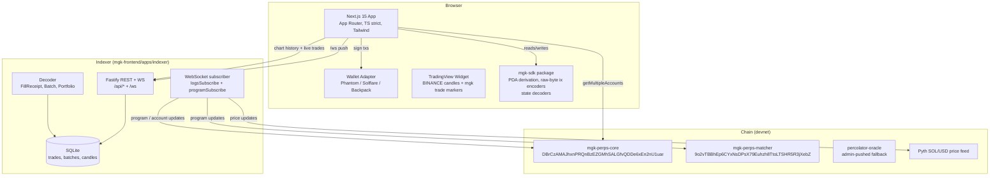

# mgk Frontend — System Design & Architecture

> **Subsystem of mgk protocol.** This subsystem consumes the on-chain mgk protocol (`programs/*`). The protocol is the source of truth; this frontend's job is to surface it to humans. When `/check-implementation` runs in this repo, the reference is the on-chain mgk protocol — see `docs/ai/design/feature-onchain-perps-dex.md` — not this frontend's design.

## Architecture Overview

A small monorepo with two deployable apps and one shared package.



**Key design choices:**

- **Two apps, one SDK.** Frontend and indexer share a TypeScript SDK (`mgk-frontend/packages/sdk`) that knows how to encode/decode the Pinocchio instructions and PDA layouts. Encoding lives in one place so program changes propagate atomically.
- **No Anchor.** mgk has no IDL, so `@coral-xyz/anchor` cannot be used for instruction building. We hand-write the encoders using `@solana/web3.js` `TransactionInstruction` with `Buffer.concat`.
- **Direct RPC from the browser** for reads that need to be fresh (portfolio, batch state). HTTP polling via `connection.getMultipleAccountsInfo` every 2–5s; no separate "RPC proxy" service in the path.
- **Indexer for history and live fan-out.** Aggregated historical candles (1m, 5m, 1h) and a persistent trade feed live in SQLite. The indexer fans out a WebSocket so multiple browser tabs do not all hit RPC.
- **TradingView widget for chart.** TradingView's free Advanced Chart widget loads BINANCE:SOLUSDT data by default, providing a production-quality chart with crosshair, OHLCV, volume, and timeframe switching out of the box. The widget is loaded from CDN (`tv.js`), deduplicated across the app, and themed to the Sharingan palette (`#0a0a0a` bg, `#1f1f1f` grid). Custom mgk trade markers are overlaid from the indexer WS. The widget avoids the Lightweight Charts' limitation of no built-in OHLCV/volume/crosshair, and the `BINANCE:*` symbol is our data source until mgk has enough devnet volume for a self-hosted data feed.

## Reference UI & Visual Identity

The mgk-frontend mirrors the visual language of [Bulk.Trade](https://bulk.trade) — a dense, professional, dark-themed perps UI. The on-chain mgk protocol already aligns with Bulk.Trade at the architecture level (commit-reveal CLOB, fair ordering, safety stack — see `docs/ai/design/feature-onchain-perps-dex.md`); this subsystem carries that alignment through to the visual surface.

**Reference (Bulk.Trade trade view):** dense 3-column layout, candle chart with crosshair tooltip, order book with depth bars and bid/ask imbalance, two-button Buy/Sell primary action, multi-tab bottom panel for positions/orders/history, slim status bar at the very bottom.

**mgk brand identity (replaces Bulk's gold/yellow accent):**

- **Formula:** "Sharingan red on black" — bright crimson accent on a pure-black canvas, with black tomoe-style negative space used as a decorative motif (logo mark, dividers, hover halos). The red doubles as the brand accent *and* the sell-side semaphore; green stays for buy/long by convention.
- **Voice:** aggressive, direct, sharp. No soft pastels, no rounded large corners on the trade surface. Status pills are pill-shaped but the chart and book use squared corners.
- **Logo:** the "mgk" wordmark preceded by a stylized eye mark (the *mangekyo* — three comma-shaped tomoe rotating around a center dot). Rendered as a single inline SVG, monochrome red on dark, red on light in light mode (which we ship disabled — dark is the only mode in v1).

**Tone & density:**

- Information-dense, but every panel has a clear primary reading (largest number or first column).
- Numbers are the primary content — they get the most visual weight. Labels are small, gray, uppercase tracked.
- All copy is English-only (per non-goals).
- Light mode is **not** in v1. The color tokens are written as semantic CSS variables (`--color-bull`, `--color-bear`, `--color-accent`, `--color-bg`, etc.) so a future light mode is a token swap, not a refactor.

## Visual Design System

### Color tokens

```css
/* Surfaces */
--color-bg:           #0a0a0a;   /* page background (Sharingan black) */
--color-surface-1:    #111111;   /* panel background (header, side rails) */
--color-surface-2:    #161616;   /* raised panel (order book, order form) */
--color-surface-3:    #1c1c1c;   /* hover/active row */
--color-border:       #1f1f1f;   /* hairline divider */
--color-border-strong:#2a2a2a;   /* panel border */

/* Text */
--color-text:         #e5e5e5;   /* primary text */
--color-text-muted:   #8a8a8a;   /* secondary labels, axis ticks */
--color-text-faint:   #5a5a5a;   /* tertiary, disabled */

/* Semaphores */
--color-bull:         #22c55e;   /* buy / long / positive PnL */
--color-bear:         #dc2626;   /* sell / short / negative PnL  (Sharingan red) */
--color-accent:       #dc2626;   /* brand accent (same as bear — intentional) */
--color-warn:         #f59e0b;   /* stale, reconnecting, devnet warning */
--color-info:         #3b82f6;   /* batch phase, neutral info */

/* Status */
--color-online:       #22c55e;   /* connection dot green */
--color-offline:      #dc2626;   /* connection dot red */
--color-devnet:       #f59e0b;   /* devnet pill (always orange in v1) */
```

### Typography

- **Sans (UI, labels, body):** `Inter` (variable). 13–14px body, 11px labels (`text-[11px] uppercase tracking-wider text-muted`).
- **Mono (numbers, prices, qty, slots, PnL):** `JetBrains Mono` (variable). Tabular numbers (`font-variant-numeric: tabular-nums` is the default on `<td>`/`<span>` in this app). 16–24px for primary price, 12–13px for body numbers, 11px for axis ticks.
- **Logo wordmark:** custom-display or `Inter` at 700 weight, letter-spaced. "mgk" only, no tagline in v1.

### Density

- Row height: 22px (order book, recent trades, open orders list).
- Panel padding: 8px (compact) / 12px (default) / 16px (page-level).
- Header height: 44px. Ticker bar height: 32px. Status bar height: 24px.
- Border radius: 4px on panels, 2px on inputs/buttons, 9999px (pill) on status chips.
- Shadows: none. Borders do the work.

## Page Layouts

### Trade page (the main view)

```
┌─────────────────────────────────────────────────────────────────────────────────────┐
│  HEADER (44px)                          TICKER (32px)                                │
│  [mangekyo] mgk   Trade Stake Sub   │  BTC-USD +0.48%  ETH-USD -0.17%  SOL-USD +1.09%│
│                          Subaccounts│                                                 │
│            [Mainnet Predeposits] CTA│                                                 │
│                                                          [theme][lang][settings][Wallet]│
├─────────────────────────────────────────────────────────────────────────────────────┤
│ MARKET HEADER (48px)                                                                       │
│ [★ SOL-USD Perp ▾]  150.42  +1.23 +0.82% │ Last: 150.40  Oracle: 150.38  24h Vol: $X  OI: $Y  Batch: Committing 00:24:40 │
├──────────────────────────────────────────┬───────────────────┬──────────────────────────┤
│                                          │                   │                          │
│  CHART (≈50% width)                      │  ORDER BOOK (≈22%)│  ORDER FORM (≈25%)       │
│  ┌─ [1m 5m 15m 1H 4H 1D] [Indicators]   │  [Order Book | Trades]│ [Cross] [1x] [PM]     │
│  │  [Mark | Oracle] [Chart|Depth|MI]    │                   │  [Market][Limit][Pro]   │
│  │                                       │  Price   Size  Sum │                          │
│  │  ╔═══════════════════════════╗        │  150.55  2.5K  10K │  Size          Avail 0 │
│  │  ║   candlestick chart       ║        │  150.50  1.2K   7K │  ┌────────────────┐   │
│  │  ║   with crosshair tooltip  ║        │  150.48  3.1K   6K │  │ 0.00       ▾USD│   │
│  │  ║   and mgk-trade markers   ║        │  ...              │  └────────────────┘   │
│  │  ╚═══════════════════════════╝        │  150.42  ↓ 0.0007%   │  ●━●━●━●━●         │
│  │                                       │  150.40  4.3K   4K │  □ Reduce Only         │
│  │                                       │  150.38  2.1K   2K │  □ TP/SL               │
│  │                                       │  [B 57% ▰▰▰▰▱▱▱ S 43%] │  ┌────────┬────────┐│
│  │                                       │                   │  │Buy/Long│Sell/Sh ││
│  │                                       │                   │  └────────┴────────┘│
│  │                                       │                   │  Current Pos: 0 SOL │
│  │                                       │                   │  Liq: — / —         │
│  │                                       │                   │  Order Value $0.00  │
│  │                                       │                   │  Margin   $0.00/$0  │
│  │                                       │                   │  Fees      — / —    │
│  │                                       │                   │  ┌─Account─────────┐│
│  │                                       │                   │  │ [Claim SOL]     ││
│  │                                       │                   │  │ [Transfer    ]  ││
│  │                                       │                   │  └─────────────────┘│
├──────────────────────────────────────────┴───────────────────┴──────────────────────────┤
│ BOTTOM TABS                                                                                │
│ [Positions (0)] [Open Orders (0)] [Balances] [Order History] [Trade History]            │
│ [Funding History] [Position History] [Account History]              [☐ Current Market] │
│                                                                                            │
│  (tab content: e.g. "You have no positions yet.")                                          │
├────────────────────────────────────────────────────────────────────────────────────────────┤
│ STATUS BAR (24px)                                                                          │
│  ● Online  [Devnet]  Batch: Committing  ▰▰▰▰▱▱▱  00:24:40  │  Wallet: Not Connected     │
└────────────────────────────────────────────────────────────────────────────────────────────┘
```

**Column proportions:** chart 5fr / order book 2fr / order form 2fr on a 1440px viewport. Below 1100px, the right column collapses below the chart; below 768px, the order form becomes a sticky bottom sheet.

**The "Funding/Countdown" slot in the market header** (Bulk shows `0.0125% 00:24:40`) is repurposed for mgk to show **batch phase + countdown** (`Committing 00:24:40` or `Clearing —`). The `0.0125%` funding rate is **not applicable** in v1 (mgk has batch auctions, not continuous funding). A future design may add a separate funding display when the protocol grows that surface.

### Landing / marketing page

Minimal. Hero with logo + tagline ("On-chain perps, fair ordering, SOL-PERP on devnet."), a `Launch App` CTA, a 3-line "How it works" section, and the same footer/status bar. No auth, no interactivity beyond the CTA.

### Portfolio page (full-screen)

Same header/ticker/status bar. Body is a single column with: `Balances` (top), `Positions` (middle), `OpenOrders` (bottom). No chart, no order form. Linked from the `Portfolio` nav item.

## Component Breakdown (updated to match the reference UI)

```
mgk-frontend/apps/web/app
├── (marketing)/page.tsx              # minimal landing, "Launch App" CTA
├── trade/page.tsx                    # the main trade view (3-column + bottom tabs + status)
├── portfolio/page.tsx                # portfolio-only view (Balances, Positions, OpenOrders)
└── layout.tsx                        # providers: wallet, query, theme, status bar

mgk-frontend/apps/web/components
├── shell/
│   ├── Header.tsx                    # logo + nav + ticker + WalletButton
│   ├── TickerBar.tsx                 # BTC/ETH/SOL price strip (Pyth-sourced)
│   ├── StatusBar.tsx                 # online/devnet/batch/wallet — sticky bottom
│   └── PageFrame.tsx                 # max-width container, dark surface, scroll containment
├── market/
│   ├── MarketHeader.tsx              # market selector + last price + stats row
│   ├── MarketSelector.tsx            # dropdown — SOL-USD only in v1, but renders future-ready
│   └── StatPill.tsx                  # "Last Price 150.40", "Oracle 150.38", "Batch 00:24:40"
├── chart/
│   ├── PriceChart.tsx                # TradingView widget wrapper, timeframe + view-mode tabs
│   ├── ChartToolbar.tsx              # 1m/5m/15m/1H/4H/1D, Indicators button, Mark/Oracle toggle, Chart/Depth/Market Info toggle
│   ├── TradingViewWidget.tsx         # Free Advanced Chart widget (BINANCE data, dark palette)
│   └── useMgkTradeMarkers.ts         # overlay fills from indexer WS as up/down triangle markers
├── trade/
│   ├── OrderBook.tsx                 # bids/asks with depth bars and B/S imbalance footer
│   ├── DepthRow.tsx                  # one row of the book — price, size, sum, depth bar bg
│   ├── OrderBookImbalance.tsx        # the "B 57% / S 43%" bar at the bottom
│   ├── RecentTrades.tsx              # from indexer WS
│   ├── BatchTimeline.tsx             # phase + countdown (also surfaced in market header + status bar)
│   └── RiskPanel.tsx                 # liq price, margin, leverage (right rail under the form)
├── orderform/
│   ├── OrderForm.tsx                 # the right-rail panel: tabs, size, reduce-only, TP/SL, Buy/Sell
│   ├── MarginModeTabs.tsx            # just 'Cross' in v1 (locked) — kept as component for future
│   ├── OrderTypeTabs.tsx             # just 'Limit' in v1 (locked)
│   ├── SizeInput.tsx                 # numeric input + USD dropdown + 5-tick slider
│   ├── BuySellButtons.tsx            # the two big buttons (green Buy / red Sell)
│   └── AccountActions.tsx            # Claim SOL + Transfer (right-rail footer)
├── portfolio/
│   ├── Balances.tsx
│   ├── Positions.tsx
│   ├── OpenOrders.tsx                # cancel/modify
│   └── History.tsx                   # tabbed: Order/Trade/Funding/Position/Account History
├── bottom-panel/
│   ├── BottomTabs.tsx                # 8-tab strip: Positions, OpenOrders, Balances, + 5 history tabs
│   └── CurrentMarketFilter.tsx       # the 'Current Market' checkbox on the right of the tab strip
├── common/
│   ├── ErrorBoundary.tsx
│   ├── TxToast.tsx                   # shows program errors decoded
│   ├── AddressDisplay.tsx
│   ├── NumberDisplay.tsx             # monospace + tabular nums; handles lamports → SOL, scaled 1e6 prices
│   ├── PnlDisplay.tsx                # number + sign + color (also ▲/▼ icon for color-blind)
│   ├── StatusDot.tsx                 # ● online / ○ offline (color + shape, not color alone)
│   ├── Pill.tsx                      # the rounded status chip (e.g., 'Devnet', 'Batch: Committing')
│   └── Skeleton.tsx
├── brand/
│   ├── Logo.tsx                      # mangekyo SVG + 'mgk' wordmark
│   └── icons/                        # inline SVGs: tomoe, bull-arrow, bear-arrow, etc.
└── providers/
    ├── SolanaProvider.tsx            # connection + wallet adapter
    ├── IndexerProvider.tsx           # WS connection + REST client
    └── ThemeProvider.tsx             # CSS variables; dark only in v1 (token API ready for light later)

mgk-frontend/apps/indexer/src
├── main.ts                           # Fastify server, WS upgrade
├── subscriber.ts                     # Solana logsSubscribe loop
├── decoder.ts                        # FillReceipt / BatchState decoders
├── aggregator.ts                     # candle bucketing, OI, mark
├── store.ts                          # better-sqlite3 wrapper
└── rest/
    ├── markets.ts
    ├── candles.ts
    ├── trades.ts
    ├── book.ts
    └── batch.ts

mgk-frontend/packages/sdk/src
├── programs/
│   ├── core.ts                       # encoders + discriminators
│   ├── matcher.ts
│   └── oracle.ts
├── pda.ts                            # all derive* functions
├── state.ts                          # all decode* functions
├── instruction.ts                    # low-level byte readers (mirrors programs/common/src/instruction.rs)
├── error.ts                          # PercolatorError → human message map
├── math.ts                           # scaled price/qty helpers (1e6 scale)
└── pyth.ts                           # SOL/USD feed lookup, Hermes URL
```

### Drawing tools (deferred to post-v1)

The Bulk.Trade reference shows a vertical drawing-tool toolbar on the left of the chart (cursor, crosshair, trend line, fibonacci, etc.). **Lightweight Charts does not include drawing tools** — they require a custom canvas overlay on top of the chart. For v1, we ship **no drawing tools**. The chart is interactive (zoom, pan, crosshair tooltip, timeframe switching, indicator overlays via Lightweight Charts' built-in series) but not annotatable. Drawing tools are documented as a post-v1 feature in the design doc so we do not forget the visual parity goal.

### Chart view-mode toggles (Chart / Depth / Market Info)

The screenshot has a `Chart | Depth | Market Info` tab strip on the chart header. v1 ships **Chart** (candles) and **Market Info** (the stats panel: 24h vol, OI, funding, mark vs oracle). The **Depth** tab (a depth chart, separate from the order book column) is **deferred to post-v1** — the order book column already conveys depth.

### Header CTA: "Mainnet Predeposits" → "Get devnet SOL"

The reference UI has a high-contrast orange "Mainnet Predeposits" CTA in the header. For mgk devnet, we replace this with a **"Get devnet SOL"** pill-link that opens `https://faucet.solana.com` in a new tab (per the resolved requirements decision: external faucet link only, no in-app airdrop button). The CTA is the only orange element on the page (uses `--color-warn`), making it visually distinct without competing with the red brand accent.

## Data Models

### On-chain account layouts (BPF-native)

These match the `bytemuck`-defined `Pod` types in `programs/common/src/types.rs` and the per-program state modules. The TS decoders in `mgk-frontend/packages/sdk` read by BPF layout (note from memory: i128 alignment differs between host and BPF — 8 on BPF, 16 on host — so we never import the Rust struct size; we use a hand-rolled layout table).

#### Portfolio PDA (`["portfolio", user_pubkey]`)

| Offset | Size | Field | Type | Notes |
|---|---|---|---|---|
| 0 | 8 | discriminator | u64 | magic |
| 8 | 32 | owner | pubkey | wallet pubkey |
| 40 | 8 | free_collateral | i64 | lamports, clamped ≥ 0 |
| 48 | 8 | locked_collateral | i64 | locked in current batch commitments |
| 56 | N×32 | positions[] | (instrument_id:u16, size:i64, entry_price:i64, ...) | per-instrument |
| ... | 1 | bump | u8 | PDA bump |

The SDK exposes `decodePortfolio(buffer: Buffer): PortfolioState` that returns a typed object with the fields above plus derived values (margin ratio, total collateral, unrealized PnL per position).

#### Batch PDA (`["batch", batch_id_le_u64]`)

| Offset | Size | Field | Type | Notes |
|---|---|---|---|---|
| 0 | 8 | discriminator | u64 | |
| 8 | 8 | batch_id | u64 | monotonically increasing |
| 16 | 8 | commit_deadline_slot | u64 | slots |
| 24 | 8 | close_slot | u64 | set at close_committing (the shuffle seed) |
| 32 | 1 | phase | u8 | 0=Committing, 1=Revealing, 2=Clearing, 3=Settled |
| 33 | 2 | num_commitments | u16 | |
| 35 | 2 | num_fills | u16 | |
| 37 | 8 | vwap | i64 | set at clear |
| 45 | 8 | funding_rate | i64 | set at settle |
| 53 | 1 | bump | u8 | |

#### Commitment PDA (`["commit", batch_id_le_u64, user_pubkey, salt_le_u64]`)

| Offset | Size | Field | Type | Notes |
|---|---|---|---|---|
| 0 | 8 | discriminator | u64 | |
| 8 | 32 | user | pubkey | |
| 40 | 8 | batch_id | u64 | |
| 48 | 32 | commitment_hash | [u8; 32] | sha256(order fields || salt) |
| 80 | 1 | bump | u8 | |

#### Book PDA (`["book", instrument_id_le_u16]`, owned by matcher)

The matcher program's book is more complex. For the MVP the frontend reads only **top-N levels per side** and **trader's own resting orders**. The SDK exposes a `decodeBookTopN(buffer, depth)` helper that returns `{ bids: Level[], asks: Level[] }` and `decodeRestingOrdersForUser(bookBuffer, ownerPubkey, programId)` for cancellations/modifications.

### Indexer SQLite schema

```sql
CREATE TABLE fills (
  slot INTEGER NOT NULL,
  batch_id INTEGER NOT NULL,
  instrument_id INTEGER NOT NULL,
  taker_side INTEGER NOT NULL,        -- 0 buy, 1 sell
  price INTEGER NOT NULL,             -- i64, scaled (1e6)
  qty INTEGER NOT NULL,               -- u64
  taker_pubkey BLOB NOT NULL,
  maker_pubkey BLOB NOT NULL,
  tx_signature BLOB NOT NULL,
  PRIMARY KEY (tx_signature, instrument_id)
);
CREATE INDEX idx_fills_instrument_slot ON fills(instrument_id, slot DESC);

CREATE TABLE candles_1m (
  instrument_id INTEGER NOT NULL,
  open_ts INTEGER NOT NULL,           -- unix seconds, bucket start
  open INTEGER NOT NULL,
  high INTEGER NOT NULL,
  low INTEGER NOT NULL,
  close INTEGER NOT NULL,
  volume INTEGER NOT NULL,
  PRIMARY KEY (instrument_id, open_ts)
);
-- candles_5m, candles_1h same shape.

CREATE TABLE batch_events (
  batch_id INTEGER NOT NULL,
  ts INTEGER NOT NULL,
  phase INTEGER NOT NULL,             -- 0..3
  num_commitments INTEGER,
  close_slot INTEGER,
  vwap INTEGER,
  PRIMARY KEY (batch_id, phase)
);

CREATE TABLE market_state (
  instrument_id INTEGER PRIMARY KEY,
  last_price INTEGER,
  mark_price INTEGER,
  open_interest_long INTEGER,
  open_interest_short INTEGER,
  funding_rate INTEGER,
  updated_ts INTEGER
);
```

The indexer computes candles by bucketing fills into 1m/5m/1h windows on insert. The "backdrop" candles before mgk had any fills are fetched from Pyth on first chart load and stored alongside.

### Frontend state (Zustand stores)

- `useWalletStore` — connection, publicKey, signTransaction
- `useMarketStore` — current instrument, list of markets
- `useBatchStore` — current batch phase, time-to-close, num commitments
- `usePortfolioStore` — portfolio PDA, free/locked, positions, PnL
- `useOpenOrdersStore` — user's resting orders across all instruments
- `useOrderFormStore` — in-flight commit (salt, batch_id, hash) persisted to localStorage

## API Design

### Indexer HTTP (`mgk-frontend/apps/indexer`, Fastify)

| Method | Path | Response | Notes |
|---|---|---|---|
| GET | `/api/markets` | `Market[]` | from Registry PDA, cached 30s |
| GET | `/api/markets/:id/candles` | `Candle[]` | query: `from`, `to`, `resolution` = `1m`\|`5m`\|`1h` |
| GET | `/api/markets/:id/trades` | `Fill[]` | query: `limit` ≤ 200, `before` (slot) |
| GET | `/api/markets/:id/book` | `{ bids, asks }` | top 20 each side |
| GET | `/api/batch/current` | `Batch` | |
| GET | `/api/healthz` | `{ ok, lastSlot, lag }` | |

### Indexer WebSocket (`/ws`)

Server pushes:

```json
{ "type": "fill",    "instrumentId": 1, "fill": { ... } }
{ "type": "batch",   "batch": { "id": 42, "phase": 1, "numCommitments": 7, "closeSlot": 312345678 } }
{ "type": "mark",    "instrumentId": 1, "markPrice": 150_000000, "fundingRate": 12 }
{ "type": "ping",    "ts": 1700000000000 }
```

Client sends `{ "type": "subscribe", "instrumentId": 1 }` once on connect. Server responds with a snapshot `{ "type": "snapshot", "bids": [...], "asks": [...], "lastTrades": [...] }` then streams deltas.

### Direct RPC calls (from `mgk-frontend/apps/web`)

These do **not** go through the indexer — they are freshness-critical and small:

- `getMultipleAccountsInfo([portfolioPda, batchPda, bookPda, ...])` every 2–5s when the trade page is focused
- `getAccountInfo(commitmentPda)` after a CommitOrder tx confirms
- `getSignatureStatuses([txSig])` for in-flight txs

### Encoders / decoders (`mgk-frontend/packages/sdk`)

`@mgk/sdk` exports pure functions, no React, no Solana deps in core (uses `@solana/buffer-layout` only):

```ts
encodeInitialize(ix: InitializeArgs): Buffer
encodeInitPortfolio(user: PublicKey): { ix: TransactionInstruction, pda: PublicKey }
encodeDeposit(amount: number): TransactionInstruction
encodeWithdraw(amount: number): TransactionInstruction
encodeCommitOrder(args: CommitOrderArgs): { ix, commitmentPda, hash }
encodeRevealOrder(args: RevealOrderArgs): { ix }
encodeCancelRestingOrder(orderId: bigint): TransactionInstruction
encodeModifyRestingOrder(orderId: bigint, newQty: bigint): TransactionInstruction
encodeCloseCommitting(): TransactionInstruction
encodeClearBatch(numCommitments: number): TransactionInstruction
encodeSettleBatch(numCommitments: number, numPortfolios: number): TransactionInstruction
encodeAddInstrument(args): TransactionInstruction  // governance-only, hidden behind a feature flag
encodeLiquidateUser(numOracles: number): TransactionInstruction

derivePortfolioPda(user: PublicKey): [PublicKey, number]
deriveBatchPda(batchId: bigint): [PublicKey, number]
deriveCommitmentPda(batchId: bigint, user: PublicKey, salt: bigint): [PublicKey, number]
deriveBookPda(instrumentId: number): [PublicKey, number]
deriveInstrumentPda(instrumentId: number): [PublicKey, number]
deriveRegistryPda(): [PublicKey, number]
deriveVaultPda(): [PublicKey, number]

decodePortfolio(buf: Buffer): PortfolioState
decodeBatch(buf: Buffer): BatchState
decodeCommitment(buf: Buffer): CommitmentState
```

The discriminator table (single source of truth, mirrored from `programs/perps-core/src/entrypoint.rs` lines 35–47):

| Discriminator | Instruction | Module |
|---|---|---|
| 0 | Initialize | core (gov) |
| 1 | InitPortfolio | core |
| 2 | Deposit | core |
| 3 | Withdraw | core |
| 4 | CommitOrder | core |
| 5 | RevealOrder | core |
| 6 | CloseCommitting | core |
| 7 | ClearBatch | core |
| 8 | SettleBatch | core |
| 9 | LiquidateUser | core |
| 10 | AddInstrument | core (gov) |
| 11 | CancelRestingOrder | core |
| 12 | ModifyRestingOrder | core |
| 13 | Match | matcher (CPI only) |
| 14 | PlaceResting | matcher (CPI only) |

Match (13) and PlaceResting (14) are called by core via CPI, never directly by a client — listed for completeness.

## Component Breakdown

```
mgk-frontend/apps/web/app
├── (marketing)/page.tsx              # minimal landing, "Launch App" CTA
├── trade/page.tsx                    # the main trade view
├── portfolio/page.tsx                # portfolio-only view (PnL, history)
└── layout.tsx                        # providers: wallet, query, theme

mgk-frontend/apps/web/components
├── wallet/
│   ├── WalletButton.tsx
│   ├── WalletProvider.tsx
│   └── useAutoConnect.ts
├── chart/
│   ├── PriceChart.tsx                # TradingView widget wrapper
│   ├── TradingViewWidget.tsx         # Free Advanced Chart widget (tv.js CDN, BINANCE data)
│   └── useMgkTradeMarkers.ts         # overlay fills from indexer WS
├── trade/
│   ├── OrderPanel.tsx                # buy/sell, price, qty, leverage, submit
│   ├── OrderBook.tsx                 # bids/asks depth view
│   ├── RecentTrades.tsx              # from indexer WS
│   ├── BatchTimeline.tsx             # phase + countdown
│   └── RiskPanel.tsx                 # liq price, margin, leverage
├── portfolio/
│   ├── Balances.tsx
│   ├── Positions.tsx
│   ├── OpenOrders.tsx                # cancel/modify
│   └── History.tsx
├── common/
│   ├── ErrorBoundary.tsx
│   ├── TxToast.tsx                   # shows program errors decoded
│   ├── AddressDisplay.tsx
│   └── Skeleton.tsx
└── providers/
    ├── SolanaProvider.tsx            # connection + wallet adapter
    └── IndexerProvider.tsx           # WS connection + REST client

mgk-frontend/apps/indexer/src
├── main.ts                           # Fastify server, WS upgrade
├── subscriber.ts                     # Solana logsSubscribe loop
├── decoder.ts                        # FillReceipt / BatchState decoders
├── aggregator.ts                     # candle bucketing, OI, mark
├── store.ts                          # better-sqlite3 wrapper
└── rest/
    ├── markets.ts
    ├── candles.ts
    ├── trades.ts
    ├── book.ts
    └── batch.ts

mgk-frontend/packages/sdk/src
├── programs/
│   ├── core.ts                       # encoders + discriminators
│   ├── matcher.ts
│   └── oracle.ts
├── pda.ts                            # all derive* functions
├── state.ts                          # all decode* functions
├── instruction.ts                    # low-level byte readers (mirrors programs/common/src/instruction.rs)
├── error.ts                          # PercolatorError → human message map
├── math.ts                           # scaled price/qty helpers (1e6 scale)
└── pyth.ts                           # SOL/USD feed lookup, Hermes URL
```

## Design Decisions

### Why a separate indexer (vs frontend-only)

Without an indexer, the chart cannot show historical candles (the on-chain CLOB only has fills since deployment, and the chart needs depth from first paint). The indexer also batches one Solana WS subscription across all browser tabs, keeping us under the 4-sub pubkey limit per connection on devnet RPCs.

### Why no Anchor / IDL

Pinocchio has no IDL. Using `@coral-xyz/anchor` would force us to hand-write an IDL anyway, with no type-checked benefit, while adding a 200kB dep. `@solana/web3.js` + `@solana/buffer-layout` is leaner and gives us direct control of byte layout (critical given the i128 BPF-vs-host alignment note in memory).

### Why pnpm workspaces (not Turborepo / Nx)

Two apps + one package. pnpm workspaces cover our needs without the build-orchestration overhead. We can promote to Turborepo later if we add a third app.

### Why Zustand (not Redux / React Query for everything)

Most app state is ephemeral and synchronous (form, current batch, wallet). React Query is excellent for the indexer REST (we use it there) but Zustand is simpler for the cross-cutting UI state.

### Why client-side commit-reveal orchestration (not server-side)

The on-chain protocol is the source of truth: the salt + batch_id + commitment hash must come from the user's wallet/session, not a server, otherwise we centralize MEV. The UI generates a CSPRNG salt, derives the hash client-side, and persists `{salt, batch_id, hash, side, price, qty, instrumentId}` to localStorage between Commit and Reveal so a refresh does not strand the order.

### Why TradingView widget and not Lightweight Charts

The TradingView Advanced Chart widget provides a production-quality chart experience out of the box: OHLCV candles, volume histogram, crosshair tooltip, timeframe switching, and zoom/pan — features that would require significant custom implementation in Lightweight Charts. The free widget (`tv.js` from CDN) is available without a signed license agreement for non-commercial devnet use. The widget loads `BINANCE:SOLUSDT` data as the default symbol, giving a real-looking chart from first load. Custom mgk trade markers are overlaid from the indexer WebSocket feed. The widget is wrapped in `<TradingViewWidget/>` so a migration to a self-hosted data feed or a different charting library is local to one component.

**Trade-off:** The widget shows centralized exchange data (BINANCE) rather than the on-chain Pyth price feed. For devnet MVP with one market and low volume, this is acceptable — the chart shows realistic price action, and mgk's own trade markers are overlaid as the protocol generates fills. A post-v1 task would pipe Pyth Hermes candles as the primary data source once mgk has sufficient devnet volume.

### Why direct RPC + Helius fallback (no custom RPC proxy)

Public devnet RPC is rate-limited but free; Helius free is fast. A proxy would let us add caching, but the cache-invalidation surface (every fill changes the book) is too large for the devnet MVP. If we hit limits we add Vercel KV or a tiny in-memory cache in the indexer.

### Why "Sharingan red on black" — and why red doubles as the brand accent and the sell side

Perps traders read red/green instantly — green = long/up, red = short/down is muscle memory. The Bulk.Trade reference uses gold/yellow as the brand accent, which sits orthogonally to the semaphores and reads cleanly. For mgk, the user requested a "Sharingan red on black" identity. Two options were considered: (a) pick a non-semaphore color for the brand (teal, violet) and keep red purely for sell, or (b) let the brand red *be* the sell red. We chose (b) because:

- The palette stays tight: black surface, one red, one green, plus a single orange accent for the devnet-CTA slot.
- The double-meaning reads as intentional aggression (which is the point of the Sharingan reference) — the brand *is* the sell side, in a sense.
- The a11y invariant is preserved: color is never the only signal. Red is always paired with `▼` / `−`; green always with `▲` / `+`. Status uses shape (●/○) on top of color.
- A future light mode would need a separate design pass regardless; in dark mode the brand red works for both meanings.

### Why simplify the order form to two locked tabs (`Cross` / `Limit`)

The reference shows `Cross / 1x / PM` and `Market / Limit / Pro`. mgk v1 supports only cross-margin, 1x, and limit orders. Three options: show all six with some disabled; show all six with click-toast "coming soon"; or show only the two that work. We chose the two-tab version because it is the **most truthful** to the protocol — UI surface should not lie about what the chain will accept. Disabled-with-toast is the worst of both worlds: visual parity without functionality. The two locked tabs are easy to extend (just add `<OrderTypeTab value="Market" />` later) without ripping out a half-built tab row.

### Why defer drawing tools and the depth-chart view to post-v1

The reference's chart has two features that Lightweight Charts does not ship: (1) a vertical drawing-tool toolbar (cursor, trend line, fibonacci, etc.) implemented as a custom canvas overlay, and (2) a `Depth` view-mode that draws a depth chart (cumulative bid/ask size vs price). Both are significant work (a drawing tool is essentially a state machine + canvas overlay; a depth chart is a separate series with non-trivial math). Neither blocks the v1 acceptance criteria (E2E happy path on devnet). They are documented as post-v1 so the visual parity goal is not forgotten when we add a v1.1 milestone.

## Non-Functional Requirements

### Performance

- First Contentful Paint < 1.5s on a 4G Moto G4 profile
- Chart interactive within 2s (200 historical candles loaded)
- Order submit → toast confirmation < 3s p95 on devnet
- Portfolio poll cycle 2–5s; never exceed 4 simultaneous `getMultipleAccounts` per tab
- Bundle: route-level code split, chart loaded via `next/dynamic` (`ssr: false`)

### Scalability

- Single devnet indexer handles ~50 concurrent WS clients (Node single-process is fine for devnet)
- SQLite is fine up to ~1M fills (~10MB) before we'd move to Postgres + Timescale
- Vercel deploy with one region (iad1); region pinned to avoid latency variance

### Security

- Wallet adapter is the only signer. The web never holds private keys.
- localStorage is for in-flight commit metadata only; cleared after Reveal confirms (success or slash).
- CSP: `default-src 'self'`, `connect-src 'self' https://api.devnet.solana.com https://*.helius-rpc.com https://hermes.pyth.network ws: wss:`, no `unsafe-eval`, no `unsafe-inline` for scripts
- Strict-Transport-Security, X-Frame-Options DENY, X-Content-Type-Options nosniff
- All txs serialized through a single `sendAndConfirm` helper that:
  - sets `preflightCommitment: 'confirmed'`
  - surfaces program errors via the `Error → human message` map
  - shows the explorer link in the toast
- The dev-only "Crank Batch" and "Liquidate" buttons are gated behind a `?devtools=1` query param and a wallet-allowlist env var

### Reliability

- Indexer is restartable; on boot it back-fills the last 1000 slots from `getBlocks` so the chart and book are accurate after a restart
- Frontend tolerates indexer downtime: chart still shows Pyth candles; order book shows "indexer reconnecting" banner
- All Solana RPC calls have a 10s timeout; on timeout the user sees a friendly retry button

### Accessibility

- All interactive elements keyboard-navigable
- Order form uses native `<input type="number">` with `inputMode="decimal"` for mobile keyboards
- Color is never the only signal (red/green always paired with ▲/▼ icons)
- All text ≥ 14px on mobile
