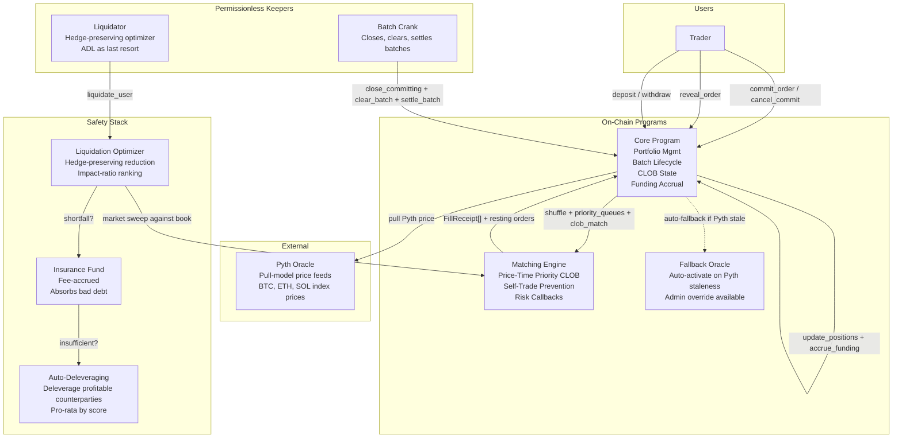

# On-Chain Perpetuals DEX Design

## Architecture Overview

A fully on-chain perpetual futures exchange on Solana using a **commit-reveal CLOB** model with **deterministic shuffle and structural priority queues** (aligned with Bulk.Trade's fair ordering design). Every order — submission, reveal, match, and settlement — executes on-chain. MEV is mitigated through sealed commitments. Within each batch, revealed orders are shuffled using Fisher-Yates seeded by the close slot, then separated into priority queues (cancels → post-only/ALO → regular), then matched against the resting order book with price-time priority. GTC orders that don't cross the spread rest on the book for future batches.



**Key architectural principle:** The Core Program is the single custody authority. All SOL collateral lives in Core-controlled vaults/PDA portfolios. The Matching Engine holds the order book state but never holds funds. This follows the Solana "authority isolation" pattern: only one program can move user funds.

**Fair ordering principle (aligned with Bulk.Trade):** Bulk.Trade does NOT use FIFO ordering. Instead it uses a 4-layer fair ordering system: (1) quorum-controlled batch admission, (2) deterministic Fisher-Yates shuffle, (3) structural priority queues, (4) price-time priority on the CLOB. Since we cannot replicate quorum admission on-chain (it requires BULKBFT consensus), we use commit-reveal as our Layer 1 MEV protection, then adopt Bulk.Trade's Layers 2-4: deterministic shuffle seeded by close_slot, structural priority queues (cancels → post-only/ALO → regular), and price-time priority CLOB matching. Orders that don't cross the spread rest on the book as GTC orders, providing persistent liquidity across batches.

**Safety stack principle (aligned with Bulk.Trade):** Liquidation optimizer (hedge-preserving, impact-ratio ranked) → Insurance fund → Auto-Deleveraging (ADL). The optimizer selectively reduces positions that contribute most to portfolio risk while preserving hedges. ADL deleverages profitable counterparties as a last resort — ranked by `max(1, PnL)^w * leverage^(1-w)` and allocated pro-rata.

## Why Not FIFO (From Bulk.Trade)

FIFO creates time-based advantages for colocated participants who can submit orders faster. Bulk.Trade's deterministic shuffle eliminates any time-based priority within a batch, making submission order irrelevant. Combined with structural priority queues, this provides fairness guarantees that FIFO cannot:

| FIFO Weakness | Shuffle + Priority Queue Fix |
|---------------|------------------------------|
| Time advantage for colocated/fast participants | Shuffle randomizes order within batch — submission time is irrelevant |
| No guarantee cancels execute before fills | Cancels always execute before all order types (structural priority) |
| No guarantee makers seed book before takers cross | Post-only/ALO orders execute before regular orders (structural priority) |
| Sort key grinding possible even with protocol_nonce | Shuffle seed is consensus output — no grinding vector |

## Key Components & Responsibilities

### Core Program
- **Portfolio management**: Cross-margin account tracking SOL deposits, positions, and PnL per user
- **Batch lifecycle coordinator**: Manages commit → reveal → clear → settle phases
- **Commitment registry**: Stores hashed orders, collects deposits, enforces reveal deadlines with full slashing
- **Collateral vault**: PDA-controlled SOL vault, deposit/withdraw with margin checks
- **CLOB state owner**: Owns order book accounts, manages resting order lifecycle (place, cancel, modify)
- **Custody**: Only program authorized to move user funds
- **Mark price computation**: Simplified composite of depth-weighted book mid + oracle fallback

### Matching Engine Program
- **CLOB matching**: Price-time priority order book. Aggressive orders walk the book; passive orders rest at their limit price. Each fill at the resting order's price (maker price).
- **Deterministic shuffle**: Fisher-Yates algorithm seeded by close_slot (batch timestamp). Shuffles revealed orders before queue separation.
- **Structural priority queues**: After shuffle, orders are separated: cancels → post-only/ALO → regular. Within each queue, execution follows shuffled order.
- **Self-trade prevention**: When an incoming order would match against a resting order from the same account, the resting order is cancelled (not matched).
- **Risk callbacks**: After each fill, verify the resulting position remains within margin limits. If a fill would cause a margin breach, cancel the remainder.
- **Stateful**: Maintains persistent order book accounts (bids + asks) across batches. GTC orders rest on the book between batch clearing cycles.

### Oracle Layer (Pyth + Fallback)

**Design principle**: Trading prices must emerge from two-sided orderbook flow between competing participants — not from an external feed. Pyth serves only as a reference anchor for funding rate calculation, mark price stabilization, and liquidation risk assessment. It never determines execution price.

**Primary: Pyth pull oracle**
- Pyth provides battle-tested, decentralized price feeds for BTC/USD, ETH/USD, SOL/USD
- Pull model: Core Program reads Pyth price accounts directly via `pyth-solana-receiver-sdk`
- Validates price freshness (configurable `max_staleness_slots` per instrument), confidence interval, and trading status
- **Role**: Index price for funding rate, mark price oracle component, liquidation marking
- **Not**: Trade execution price — that's discovered on-chain via CLOB matching

**Fallback: Minimal on-chain oracle**
- Governance can push a manual price to a fallback oracle account
- Activated automatically when Pyth price is stale (slot age exceeds `max_staleness_slots`), frozen, or confidence exceeds threshold
- Admin can also manually activate/deactivate the fallback
- Same `PriceFeed` struct, managed by admin key
- Auto-activation check runs inline during any instruction that reads oracle prices

### Liquidation Optimizer (Simplified from Bulk.Trade)
- **Hedge-preserving**: Positions where closing would NOT reduce portfolio margin are skipped (they are hedges)
- **Impact-ratio ranking**: Positions ranked by `IR = margin_reduction / market_impact_cost`. Best ratio liquidated first.
- **Iterative**: Up to 10 rounds (simplified from Bulk.Trade's 100). Reduces 5-25% of position size per round based on urgency.
- **Fallback**: If optimizer cannot restore margin after all rounds, full flat of all positions.
- **ADL trigger**: If liquidation produces shortfall beyond insurance fund, ADL activates.

### Keepers (Permissionless Off-Chain Agents)
- **Batch Crank**: Closes committing phase when batch criteria met, triggers clearing, settles batch
- **Liquidator**: Monitors portfolio health, runs liquidation optimizer, executes market sweeps against book

## Batch Lifecycle

A trading **batch** progresses through four phases. The CLOB persists across batches — resting orders survive between clearing cycles.

```
                     close_committing              clear_batch                          settle_batch
                     records close_slot            1. Fisher-Yates shuffle
                          |                       2. Priority queue separation
                          |                       3. CLOB match: cancels, ALO, regular
                          |                       4. Resting orders stay on book
  ┌──────────────┐      ▼      ┌──────────────┐      ▼      ┌──────────────┐      ▼      ┌──────────────┐
  │  COMMITTING  │────►│  REVEALING   │────►│   CLEARING   │────►│   SETTLED    │
  │              │             │              │              │             │              │
  │ Users submit │             │ Users reveal │             │ Shuffle +   │ Positions    │
  │ hashed orders│             │ order params │             │ priority    │ updated.     │
  │ + deposits   │             │ + salts +    │             │ queues +    │ Deposits back│
  │ + cancels    │             │ order type   │             │ CLOB match  │ Funding      │
  │              │             │              │             │ GTC rests   │ accrued.     │
  └──────────────┘             └──────────────┘             └──────────────┘              └──────────────┘
```

### Phase 1: Committing
- Users submit `hash(order_type, side, price, qty, salt, user_pubkey, batch_id)` to the Core Program
- Order types: `Limit(GTC)`, `Limit(IOC)`, `Limit(ALO)`, `Market`, `Cancel`, `CancelAll`
- A commitment deposit is locked (dynamic, risk-based: `base_deposit * volatility_multiplier[instrument]`)
- Cancel commitments reference an existing resting order ID (no deposit needed)
- Phase closes when **dynamic criteria** are met:
  - `N_commitments >= N_min AND time_since_last_clear >= T_min` OR `time_since_last_clear >= T_max`
- A crank can trigger `close_committing` once criteria are satisfied

### Phase 2: Revealing
- Users reveal their actual order parameters + salt
- Core Program verifies `hash(order_type, side, price, qty, salt, user, batch_id) == stored_commitment`
- Reveal deadline: `T_reveal` after commit phase closes (e.g., 5 seconds / ~12 slots)
- Users who **do not reveal** by deadline: **commitment deposit fully slashed**, order excluded from batch

### Phase 3: Clearing
- Crank calls `clear_batch(batch_id)` on the Core Program
- Core sends all revealed orders plus the close slot to the Matching Engine via CPI
- **Step 1 — Shuffle**: Fisher-Yates shuffle of all revealed orders, seeded by `close_slot` as PRNG seed. This randomizes order within the batch, making submission timing irrelevant.
- **Step 2 — Priority queue separation**:
  1. **Cancel orders** (cancel-one, cancel-all) — execute first
  2. **Post-only / ALO orders** — execute second (must rest on book; rejected if would cross spread)
  3. **Regular orders** (market, limit GTC, limit IOC) — execute third
- **Step 3 — CLOB matching**: Within each priority queue, process orders in shuffled order:
  - **Aggressive orders** (market, or limit that crosses the spread): Walk the book, match against resting orders at best available prices. Each fill at the resting (maker) order's limit price. Risk callback after each fill — if fill would breach margin, cancel remainder.
  - **Passive orders** (limit that doesn't cross): Rest on the book at their limit price as GTC orders.
  - **ALO orders**: If they would cross the spread (take liquidity), they are **rejected** (`rejectedCrossing`). Otherwise they rest on the book as maker orders.
  - **IOC orders**: Fill what's available immediately. Unfilled remainder is cancelled.
- **Step 4 — Resting orders persist**: GTC orders that weren't matched or cancelled remain on the book for future batches. The book is not cleared between batches.
- Core updates portfolio positions and PnL for each fill

### Phase 4: Settled
- Commitment deposits returned to filled users (net of trading fees)
- Maker rebates applied (maker_fee_bps is typically negative — rebate)
- Slashed deposits from non-revealing users credited to insurance fund
- **Funding accrual**: Mark price computed, premium calculated, `cum_funding` updated, funding payments applied to portfolios with positions
- Batch status finalized; next batch opens (but book state carries over)

### Dynamic Batch Cadence Parameters

| Parameter | Purpose | Suggested Default |
|-----------|---------|-------------------|
| `N_min` | Minimum commitments to allow early close | 5 |
| `T_min` | Minimum time before early close (slots) | 10 |
| `T_max` | Maximum time before forced close (slots) | 150 |
| `T_reveal` | Reveal phase duration (slots) | 25 |

## Technology Choices & Rationale

| Choice | Rationale |
|--------|-----------|
| **Rust + Pinocchio** | `no_std`, zero-allocation, BPF-compatible. No Anchor overhead. |
| **Commit-reveal** | Eliminates mempool front-running. Order contents hidden during commitment. Salt committed in hash prevents strategic ordering. Replaces Bulk.Trade's quorum-controlled admission (infeasible on-chain). |
| **Deterministic shuffle + structural priority queues** | Aligned with Bulk.Trade's fair ordering Layers 2-3. Fisher-Yates shuffle eliminates time-advantage. Priority queues ensure cancels before fills, makers before takers. |
| **CLOB with resting orders** | Aligned with Bulk.Trade's execution model. Orders persist on the book across batches. Capital-efficient — makers earn rebates, liquidity accumulates. Price-time priority matching. |
| **Cross-margin** | Capital efficiency. Profits on one instrument offset margin on another. Same portfolio, lower total IM. |
| **SOL-only collateral** | Simplifies vault management, reduces oracle dependency for collateral pricing, eliminates multi-token LP fragmentation. |
| **Pyth oracle (primary) + admin fallback** | Spot anchor for funding + liquidation + mark price. Trading price discovered on-chain via CLOB two-sided flow — Pyth is reference-only, never determines execution price. Fallback auto-activates on staleness. |
| **Permissionless keepers** | No single point of failure. Anyone can crank batches, liquidate, or update oracles (with auth). Incentivized by fees/slashes. |
| **Three-program separation** | Core (custody + book) / Matching (compute) / Oracle (data). Enables independent upgrades via separate program IDs. |
| **Kani formal verification** | Bit-precise model checking of safety-critical invariants: conservation, margin consistency, liquidation progress, batch integrity. |
| **Liquidation optimizer + ADL** | Aligned with Bulk.Trade's safety stack. Hedge-preserving optimizer first, then insurance, then ADL as last resort. No global haircut. |
| **Static margin tiers for MVP** | IMR/MMR per instrument as BPS. Correlation-adjusted notional and lambda surfaces deferred to post-MVP. |
| **Simplified composite mark price** | Depth-weighted book mid + oracle fallback when book stale. Full 3-component model deferred to post-MVP. |
| **Single admin governance** | One key controls parameters. Simple, fast iteration. Upgrade to multisig before mainnet. |

## Order Types (Aligned with Bulk.Trade)

| Type | Behavior |
|------|----------|
| **Limit (GTC)** | Rests on the book at specified price. Fills at maker price if crossed by aggressive order. Remains until filled or cancelled. |
| **Limit (IOC)** | Fills what's available immediately against resting book. Unfilled remainder is cancelled. Never rests on the book. |
| **Limit (ALO / Post-Only)** | Must rest on the book as a maker order. If it would cross the spread and take liquidity, **rejected** (`rejectedCrossing`). Guarantees maker fee or no execution. |
| **Market** | Walks the book until fully filled or book exhausted. Equivalent to IOC with limit price = worst possible. |
| **Reduce-Only** | Modifier on any order type. Ensures order only decreases or closes an existing position — never opens new or increases size. If order would flip position direction, size is clamped to close only. |
| **Cancel** | Cancels a specific resting order by order ID. Always executes first (structural priority). |
| **Cancel-All** | Cancels all resting orders for a user in a given instrument. Always executes first (structural priority). |

## Data Models

### Portfolio (Core Program)

Per-user cross-margin account. PDA: `["portfolio", user_pubkey]`.

```rust
struct Portfolio {
    user: Pubkey,
    equity: i128,
    principal: i128,
    pnl: i128,
    im: u128,
    mm: u128,
    free_collateral: i128,
    health: i128,
    positions: [Position; MAX_POSITIONS],
    last_funding_checkpoint: [i128; MAX_INSTRUMENTS],
    open_order_count: u16,
    last_batch_id: u64,
    last_slot: u64,
    padding: [u8; PADDING],
}

struct Position {
    instrument_id: u16,
    qty: i64,
    entry_vwap: i64,
}
```

### Batch (Core Program)

PDA: `["batch", batch_id]`. A batch is the fundamental clearing epoch.

```rust
struct Batch {
    batch_id: u64,
    status: BatchStatus,
    commit_deadline_slot: u64,
    reveal_deadline_slot: u64,
    close_slot: u64,
    shuffle_seed: u64,
    total_commitments: u32,
    total_revealed: u32,
    total_fills: u32,
    total_volume: u64,
    total_notional: u128,
    slashed_deposits: u128,
    mark_price: [i64; MAX_INSTRUMENTS],
    padding: [u8; PADDING],
}

enum BatchStatus {
    Committing = 0,
    Revealing = 1,
    Clearing = 2,
    Settled = 3,
}
```

### Commitment (Core Program)

PDA: `["commitment", batch_id, user_pubkey, nonce]`. One per user order per batch.

```rust
struct Commitment {
    batch_id: u64,
    user: Pubkey,
    order_hash: [u8; 32],
    deposit_lamports: u64,
    status: CommitmentStatus,
    nonce: u64,
}

enum CommitmentStatus {
    Pending = 0,
    Revealed = 1,
    Slashed = 2,
    Settled = 3,
}
```

### Revealed Order (Core Program)

Stored after reveal, consumed during clearing.

```rust
struct RevealedOrder {
    user: Pubkey,
    instrument_id: u16,
    order_type: OrderType,
    side: Side,
    price: i64,
    qty: u64,
    salt: [u8; 32],
    commitment_idx: u32,
    reduce_only: bool,
}

enum OrderType {
    LimitGTC = 0,
    LimitIOC = 1,
    LimitALO = 2,
    Market = 3,
    Cancel = 4,
    CancelAll = 5,
}
```

### Order Book (Matching Engine Program)

PDA: `["book", instrument_id]`. Persistent across batches.

```rust
struct OrderBook {
    instrument_id: u16,
    best_bid: i64,
    best_ask: i64,
    bid_count: u32,
    ask_count: u32,
    next_order_id: u64,
    bids: [BookLevel; MAX_LEVELS],
    asks: [BookLevel; MAX_LEVELS],
    padding: [u8; PADDING],
}

struct BookLevel {
    price: i64,
    total_qty: u64,
    order_count: u16,
    first_order_offset: u32,
}

struct RestingOrder {
    order_id: u64,
    user: Pubkey,
    side: Side,
    price: i64,
    qty: u64,
    filled_qty: u64,
    instrument_id: u16,
    reduce_only: bool,
    batch_placed: u64,
    next_order_offset: u32,
}
```

### Instrument Registry (Core Program)

```rust
struct Instrument {
    instrument_id: u16,
    base_symbol: [u8; 16],
    contract_size: u64,
    tick_size: u64,
    lot_size: u64,
    imr_bps: u16,
    mmr_bps: u16,
    taker_fee_bps: u16,
    maker_fee_bps: i16,
    max_leverage: u16,
    oracle_addr: Pubkey,
    cum_funding: i128,
    last_funding_ts: i64,
    funding_interval_slots: u64,
    is_active: bool,
    padding: [u8; PADDING],
}
```

### Fallback Oracle Price Feed

```rust
struct FallbackPrice {
    instrument_id: u16,
    price: i64,
    confidence: u64,
    timestamp: i64,
    slot: u64,
    authority: Pubkey,
    is_active: bool,
}
```

## API / Interface Contracts

### Core Program Instructions

| Disc | Instruction | Input | Accounts | Auth |
|------|-------------|-------|----------|------|
| `0` | Initialize | instrument_registry | payer | Governance |
| `1` | InitPortfolio | — | portfolio_pda, user, payer | User signer |
| `2` | Deposit | lamports | portfolio, vault, user_wallet | User signer |
| `3` | Withdraw | lamports | portfolio, vault, registry, user_wallet | User signer |
| `4` | CommitOrder | hash(order_type\|side\|price\|qty\|salt\|user\|batch_id) | portfolio, batch, commitment, user | User signer |
| `5` | RevealOrder | order_type, side, price, qty, salt, reduce_only | portfolio, batch, commitment, user | User signer |
| `6` | CloseCommitting | batch_id | batch, registry | Permissionless |
| `7` | ClearBatch | batch_id | batch, matching_engine, book, user_portfolios[], registry | Permissionless (crank) |
| `8` | SettleBatch | batch_id | batch, portfolios[], commitments[], vault, oracle_feeds[] | Permissionless |
| `9` | LiquidateUser | user_pubkey | portfolio, registry, book, vault, oracle_feeds[] | Permissionless (keeper) |
| `A` | AddInstrument | instrument_params | registry, instrument, oracle_feed | Governance |
| `B` | CancelRestingOrder | order_id | portfolio, book, user | User signer |
| `C` | ModifyRestingOrder | order_id, new_qty | portfolio, book, user | User signer |

### Matching Engine Program Instructions

| Disc | Instruction | Input | Output |
|------|-------------|-------|--------|
| `0` | ShuffleAndMatch | revealed_orders[], close_slot, book_state | fills: [(user, filled_qty, notional, is_maker)…], updated_book_state |

The Matching Engine receives revealed orders + close_slot, performs:
1. Fisher-Yates shuffle seeded by close_slot
2. Priority queue separation (cancels → ALO → regular)
3. CLOB matching: aggressive orders walk the book, passive orders rest, ALO rejected if crossing
4. Self-trade prevention: cancel resting order instead of matching
5. Risk callback per fill: if fill breaches margin, cancel remainder

Returns fill receipts and updated book state.

### Fallback Oracle Program Instructions

| Disc | Instruction | Input | Auth |
|------|-------------|-------|------|
| `0` | Initialize | instrument_id, price, confidence | Admin |
| `1` | SetPrice | price, confidence | Admin |
| `2` | SetAuthority | new_authority | Admin |
| `3` | Activate | — | Admin |
| `4` | Deactivate | — | Admin |

### Keeper Incentives

| Keeper | Revenue Source |
|--------|---------------|
| Batch Crank | Portion of taker fees from batch (~10%) |
| Liquidator | Liquidation bonus (~2.5% of liquidated notional) |

### CPI Relationships

```
Core ──CPI──► Matching Engine  (clear_batch: send revealed orders + close_slot + book, receive fills + updated book)
Core ──READ──► Pyth accounts   (pull index price for funding + mark price + liquidation)
Core ──READ──► Fallback Oracle  (if Pyth stale/frozen)
Liquidator ──CALL──► Core      (liquidate_user → optimizer → market sweep against book)
Crank ──CALL──► Core           (close_committing, clear_batch, settle_batch)
```

**Critical rules:** Matching Engine never calls Core. Only Core holds custody. Pyth is read-only (no CPI). Book state lives in Matching Engine accounts but is owned/rent-exempted by Core.

## Mark Price Model (Simplified Composite)

Aligned with Bulk.Trade's philosophy: mark price should reflect executable prices, not just top-of-book.

### Primary: Depth-Weighted Book Mid

```
P_bid = sweep(sell, reference_notional)   // worst price to sell reference_notional
P_ask = sweep(buy, reference_notional)    // worst price to buy reference_notional
P_book = (P_bid + P_ask) / 2
```

Where `reference_notional` is a configurable notional amount per instrument (e.g., $10K). The depth-weighted mid accounts for actual liquidity at meaningful size, not just the top-of-book.

### Fallback: Oracle Price

When the book is stale (no updates for `book_staleness_threshold` slots) or has insufficient depth:

```
age = (current_slot - book_last_update_slot) / decay_window_slots

if age >= 1.0:
    bias = tanh((age - 0.5) * 10) * 0.5 + 0.5    // sigmoid toward oracle
    P_mark = (1 - bias) * P_book + bias * P_oracle
else:
    P_mark = P_book
```

This ensures fair pricing even in low-liquidity conditions, smoothly transitioning to oracle as the book becomes stale.

### Mark Price for Funding

During `settle_batch`, mark price is computed per instrument. If the batch had fills, use the composite mark. If no fills, carry forward from previous batch. First batch uses oracle index price.

## Funding Rate Design (Aligned with Bulk.Trade)

### Depth-Weighted Premium

Aligned with Bulk.Trade's approach: premium is computed from depth-weighted bid/ask vs oracle, not simple mid-price.

```
P_bid = sweep(sell, sample_notional)
P_ask = sweep(buy, sample_notional)
P_oracle = oracle_index_price

delta = max(P_bid - P_oracle, 0) - max(P_oracle - P_ask, 0)
premium_sample = delta / P_oracle
```

Multiple samples are taken during the batch (at each clear cycle). The funding rate uses a simple moving average (SMA) of premium samples:

### Formula

```
P_mu = SMA(premium_samples[])   // average of all samples in funding period

F = clamp(P_mu + clamp(interest_rate - P_mu, -deviation_cap, deviation_cap), -funding_cap, funding_cap)
```

| Parameter | Description | Default |
|-----------|-------------|---------|
| `interest_rate` | Base interest rate (bps) | 1 |
| `deviation_cap` | Max deviation of interest from premium (bps) | 5 |
| `funding_cap` | Absolute clamp on funding rate (bps) | 50 |
| `sample_notional` | Notional for depth-weighted sweep | 10,000 USD |

### Accrual

Funding accrues per instrument during `settle_batch`:

```
funding_period = (current_slot - last_funding_slot) / funding_interval_slots
cum_funding += funding_rate * funding_period
```

### Application

Funding is applied during **batch settlement** (`settle_batch`). No separate keeper instruction required.

```
funding_payment = position.qty * (cum_funding_current - position.last_funding_checkpoint)
portfolio.pnl += funding_payment
position.last_funding_checkpoint = cum_funding_current
```

Longs pay shorts when `funding_rate > 0` (mark > index). Shorts pay longs when `funding_rate < 0` (mark < index).

## Liquidation & Safety Stack (Aligned with Bulk.Trade)

### Trigger Condition

```
Equity < M_p  AND  Position PnL < 0
```

Where `M_p` is the portfolio maintenance margin (sum of position notionals × MMR for MVP).

### Step 1: Cancel Open Orders

All resting orders across every market are cancelled immediately to prevent the trader from increasing exposure during liquidation.

### Step 2: Compute Target

```
target = max(0, Equity * (1 - buffer))
gap = M_p - target
```

Where `buffer` is a safety margin (e.g., 10%).

### Step 3: Selective Reduction

For each position with non-zero size, compute the margin impact of reducing it. **Skip positions where closing would NOT reduce portfolio margin** (these are hedges — closing them would increase risk).

Rank remaining positions by impact ratio:

```
IR = margin_reduction / estimated_market_impact
```

Where `estimated_market_impact` comes from order book depth at the reduction size. The position with the highest IR is reduced first.

Reduction fraction based on urgency:

| Condition | Reduction Fraction |
|-----------|-------------------|
| gap > 30% of M_p | 25% of position |
| gap > 10% of M_p | 10% of position |
| gap under 10% of M_p | 5% of position |

### Step 4: Iterate

Apply best reduction, recompute gap, repeat. Up to 10 iterations (simplified from Bulk.Trade's 100). If optimizer cannot resolve, **full flat** of all positions.

### Step 5: Execute via Market Sweep

Planned reductions are executed against the order book as market sweep orders. Per-fill risk checks ensure the liquidating account's margin doesn't go further negative.

### Insurance Fund

If liquidation produces a **shortfall** (losses exceed account collateral), the insurance fund absorbs the bad debt. No liquidation fee charged to traders.

### Auto-Deleveraging (ADL)

ADL activates when:
1. Insurance fund cannot cover the shortfall from a liquidation, OR
2. There is unfilled liquidation volume (insufficient book liquidity for market sweep)

**Ranking**: Profitable counterparties on the opposite side ranked by:

```
score = max(1, PnL)^w * leverage^(1-w)
```

Where `w` is a configurable bias parameter (default: 0.5). Highest profits + highest leverage are deleveraged first.

**Allocation**: Deleveraging size distributed pro-rata by score:

```
ADL_size_i = total_shortfall * (score_i / sum_of_all_scores)
```

Positions are closed at the **entry price** of the deleveraged trader.

### Full Safety Stack

```
Margin breach detected
    → Liquidation Optimizer (hedge-preserving, impact-ratio ranked)
        → Market sweep against book
            → Shortfall?
                → No: Done
                → Yes: Insurance Fund absorbs loss
                    → Fund sufficient?
                        → Yes: Done
                        → No: ADL — deleverage profitable counterparties
```

## MEV Protection Analysis

### Threats Mitigated

| Attack | Mitigation |
|--------|-----------|
| **Mempool front-running** | Order contents hidden via hash commitment — attacker cannot see price/qty/type to front-run |
| **Sandwich attacks** | Shuffle randomizes within batch — no insertion vector. Structural priority (cancels first, ALO before regular) prevents interleaving. |
| **Priority ordering manipulation** | Shuffle seed = `close_slot`, unknown during commit. No FIFO sort keys to grind. |
| **Commit-without-reveal spam** | Full slashing of commitment deposit makes non-reveal economically irrational |
| **Time-advantage for fast/colocated participants** | Shuffle eliminates time-based priority — submission order is irrelevant |
| **Maker disadvantage** | ALO/post-only orders execute before regular orders. Makers always seed book before takers cross. |
| **Cancel race** | Cancels always execute before all other order types (structural priority) |

### Remaining Vulnerabilities

| Vulnerability | Severity | Mitigation |
|---------------|----------|------------|
| **Cross-batch front-running** | Medium | Attacker could see resting orders on the book and submit commitments for next batch. Shuffle + new seed per batch limits advantage. Resting orders are visible but their execution is not guaranteed (new orders may take priority). |
| **Shuffle seed manipulation** | Low | Close slot is set at `close_committing` time. Validators could theoretically delay/advance the close to influence the seed, but the benefit is bounded (shuffle is random, not controllable). |
| **Crank censorship** | Low | Permissionless crank — anyone can step in. |
| **Oracle manipulation** | Low | Pyth's decentralized publisher network. Fallback admin-only. Staleness + confidence checks. |

## Major Design Decisions & Trade-offs

### 1. Commit-Reveal CLOB vs Continuous CLOB vs Batch Auction

**Chosen: Commit-Reveal CLOB** (aligned with Bulk.Trade's execution model)

| Pro | Con |
|-----|-----|
| Eliminates mempool MEV | Higher latency (seconds vs milliseconds) |
| CLOB with resting orders = persistent liquidity | Two-transaction flow per order (UX friction) |
| Structural priority queues = strong fairness guarantees | Requires commitment deposit lockup |
| Shuffle eliminates time-advantage | Shuffle seed from close_slot is not as robust as Bulk.Trade's consensus-derived timestamp |
| ALO orders guarantee maker fee | CLOB state management more complex than batch auction |

**Alternatives considered**: Continuous CLOB (Serum/OpenBook model) — rejected because it offers no MEV protection. Batch auction with uniform clearing — rejected because it discourages maker liquidity and pro-rata encourages over-committing.

### 2. Bulk.Trade Safety Stack vs Global Haircut

**Chosen: Liquidation Optimizer → Insurance → ADL**

| Pro | Con |
|-----|-----|
| ADL targets only profitable counterparties, not all users | ADL is controversial UX — profitable traders get deleveraged |
| Hedge-preserving optimizer prevents cascade | More complex implementation than global haircut |
| No haircut on deposits/principal — users keep what they deposited | ADL could be exploited if scoring formula is gamed |
| Aligned with Bulk.Trade's proven design | ADL event is still a negative signal for the protocol |

**Alternative considered**: O(1) global haircut (equity_scale/warming_scale). Rejected because haircutting all users including those with no positions is less targeted than ADL which only affects profitable counterparties on the opposite side.

### 3. Three-Program Separation vs Monolith

**Chosen: Three programs (Core + Matching + Oracle)**

| Pro | Con |
|-----|-----|
| Independent upgradeability | More complex deployment |
| Matching Engine can be audited independently | CPI overhead between programs |
| Oracle can be replaced without touching Core | More program IDs to manage |
| Clear security boundaries | |

### 4. SOL-Only vs Multi-Token Collateral

**Chosen: SOL-only**

| Pro | Con |
|-----|-----|
| Single vault, no multi-token accounting | Limits user base (no USDC deposits) |
| No collateral oracle needed (SOL is native) | Harder to attract stablecoin-heavy traders |
| Simpler liquidation (no asset conversion) | |
| Lower attack surface | |

### 5. Full Slashing vs Partial Penalty

**Chosen: Full slashing of commitment deposit for non-reveal**

| Pro | Con |
|-----|-----|
| Strong disincentive against manipulation | Harsh on honest users who miss deadline |
| Revenue for insurance fund | May deter participation |

**Mitigation**: Wallet auto-reveals. Grace period / first-offense warning in UX layer.

### 6. Static Margin Tiers vs Lambda Surfaces

**Chosen: Static IMR/MMR tiers for MVP, lambda surfaces post-MVP**

| Pro | Con |
|-----|-----|
| Simple, fast to implement | Less capital-efficient than correlation-adjusted |
| Easy to reason about and audit | Doesn't account for cross-asset correlation |
| Governance can adjust per instrument | No regime-adaptive margin |

**Post-MVP upgrade**: Add correlation-adjusted effective notional (`N_eff` with `rho_ij`), then lambda surfaces with regime detection.

## Non-Functional Requirements

### Performance

| Metric | Target |
|--------|--------|
| Batch clearing compute | ≤ 300k CU for up to 64 orders (shuffle + priority + CLOB match) |
| CLOB matching per order | O(book_depth) for aggressive, O(1) for passive placement |
| Fisher-Yates shuffle | O(n) for n revealed orders |
| Portfolio update per user | O(positions) ≈ O(1) per user per batch |
| Deposit/withdraw | ≤ 50k CU |
| Pyth price read + validation | ≤ 25k CU per instrument |
| Depth-weighted mid computation | O(book_depth) — configurable reference notional |
| Market sweep for liquidation | O(book_levels_swept) |

### Security

- **Kani formal verification**: All safety-critical invariants must be proven before mainnet:
   - **Conservation**: `sum(equity) + vault_balance + insurance_balance = total_deposits + sum(pnl)` invariant preserved across all operations
   - **No over-withdrawal**: Withdraw amount ≤ free_collateral proven for all paths
   - **Liquidation progress**: Every liquidation call reduces total underwater exposure
   - **Commitment integrity**: Revealed orders always match stored hash commitments
   - **Funding conservation**: Long payments + short payments = 0 (zero-sum)
   - **Batch atomicity**: Either all fills in a batch execute or none do
   - **Self-trade prevention**: No account can match against itself
   - **Book integrity**: Order quantities never exceed deposited collateral

- **PDA authority isolation**: Core Program's vault PDA is the only key authorized to move SOL from portfolios.

- **Checked arithmetic**: All math uses checked/saturating operations. No `unwrap()` on arithmetic.

- **Rounding direction**: All fee calculations round in protocol's favor. Withdrawals round down. Funding payments round conservatively.

- **Emergency pause**: Governance can pause trading, withdrawals, liquidations, and funding independently.

### Scalability

- **Dynamic batch sizing**: Batches grow with demand. Low activity → small batches, fast clearing.
- **Resting order capacity**: Book accounts pre-allocated for MAX_LEVELS price levels. Configurable per instrument.
- **Parallel execution**: Portfolios for different users touch different accounts → Solana runtime can parallelize across users.

### Reliability

- **Permissionless keepers**: No single keeper dependency.
- **Graceful degradation**: If oracle is stale, liquidations are paused but trading continues. If funding is stuck, positions remain but no new funding accrues.
- **Persistent book**: Order book survives across batches. If a batch fails to clear, the book state is unchanged.

### UX / Accessibility

- **Wallet-native**: Users only need SOL and a Solana wallet.
- **Auto-reveal**: Wallet handles the reveal transaction automatically. Two-transaction flow feels like one.
- **Clear error messages**: Program returns human-readable error codes.
- **Reduce-only by default on liquidation**: Users can also use reduce-only modifier manually.

## Insurance Fund

Insurance fund covers bad debt from liquidations. **Fee-accrued only** — the fund starts at zero and grows organically from taker fees and slashed commitment deposits. No team pre-funding required.

**Risk**: During initial bootstrapping with low fee volume, the fund may be insufficient for large bad debt events. Mitigated by conservative initial IMR/MMR parameters and ADL as the last resort.

## Position Limits

**Dynamic, risk-based caps** per instrument:

```
max_position_notional[instrument] = min(
    available_liquidity_in_book[instrument] * liquidity_factor,
    insurance_fund_balance * leverage_cap
)
```

Governance can adjust `liquidity_factor` and `leverage_cap` per instrument. Circuit breaker: if a batch would push total open interest past the dynamic cap, reject orders that exceed it.

## Fee Distribution

| Destination | Share | Purpose |
|-------------|-------|---------|
| Insurance Fund | 60% | Cover bad debt from liquidations |
| Protocol Treasury | 40% | Team operations, infrastructure, development |

Maker fees are typically negative (rebate) to incentivize liquidity provision. Commitment slashing proceeds go 100% to the insurance fund.

## Governance

**Single admin key** controls:
- Instrument listing/delisting
- Fee parameters (taker_fee_bps, maker_rebate_bps, fee split ratios)
- Margin parameters (IMR, MMR, max_leverage)
- Emergency pause (trading, withdrawals, liquidations, funding — independently)
- Fallback oracle price updates
- Commitment deposit volatility scaling parameters
- Mark price parameters (reference_notional, book_staleness_threshold)
- Funding parameters (interest_rate, deviation_cap, funding_cap)
- ADL parameters (score_weight_w)

**Pre-mainnet upgrade**: Migrate to Squads multisig (3-of-5 or similar) for production governance.

### Emergency Pause

A `PauseFlags` bitmask in the Registry enables independent pausing of protocol functions:

```rust
struct PauseFlags {
    trading_paused: bool,
    withdrawals_paused: bool,
    liquidations_paused: bool,
    funding_paused: bool,
}
```

All paused states are checked at instruction entry. Pause does not affect batch settlement — in-flight batches complete normally. Cancel/resting order operations remain available when trading is paused (users can cancel existing orders).

## Commitment Deposit Model

Dynamic, risk-based deposit amount scaled by instrument volatility:

```
deposit = base_deposit * volatility_multiplier[instrument_id]
```

| Volatility Tier | Multiplier | Example Deposit (base = 0.01 SOL) |
|-----------------|------------|-----------------------------------|
| Low (stable assets) | 1.0x | 0.010 SOL |
| Medium (BTC, ETH) | 3.0x | 0.030 SOL |
| High (alt L1s) | 5.0x | 0.050 SOL |

Cancel commitments do not require a deposit.

## UX: Commit-Reveal Flow

The two-transaction flow is **wallet-managed**:

1. User signs a single intent ("Buy 1 BTC-PERP at $60,000, GTC")
2. Wallet generates a random salt, computes `hash(order_type|side|price|qty|salt|user|batch_id)`, sends `CommitOrder` transaction
3. Wallet waits for commitment confirmation (~1 slot)
4. Wallet automatically sends `RevealOrder` transaction with the original params + salt

The user experiences this as **one action** with a brief loading state. The wallet abstracts the two-step protocol.

**Cancel flow**: User can submit a `Cancel` commitment for a resting order. This is also commit-reveal: the cancel intent is hashed, then revealed. Cancels always execute first in the priority queue.

**Direct cancel for resting orders**: Users can also cancel resting orders directly (outside batch) via `CancelRestingOrder` instruction. This bypasses commit-reveal for speed but is only for orders already on the book — no MEV concern since the order is already visible.

## Batch Account Sizing

| Parameter | Value | Rationale |
|-----------|-------|-----------|
| Max commitments per batch | **64** | Single-CPI clear within 1.4M CU budget. Upgrade path: multi-step clear. |
| Max revealed orders per batch | 64 | Matches commitments |
| Max positions per portfolio | 32 | Covers all listed instruments |
| Max book levels per side | 64 | Price levels per side of the book |
| Max resting orders per level | 16 | Orders at each price level (FIFO queue) |
| Batch state account size | ~16 KB | 64 × commitments + metadata |
| Portfolio account size | ~8 KB | Positions + funding checkpoints + metadata |
| Order book account size | ~32 KB | Levels + resting orders + metadata |

**Upgrade path**: Multi-step clearing for >64 orders per batch. Dynamic book resizing post-MVP.

**Benchmarking plan**: Test on devnet with realistic load to validate CU limits and account sizes.

## Batch Edge Cases

| Scenario | Behavior |
|----------|----------|
| **No crossing orders** (all bids < all asks) | All revealed orders that are GTC/ALO rest on the book. IOC/Market orders cancelled unfilled. Batch settles with 0 fills but book has new resting liquidity. Mark price from depth-weighted mid or carry forward. |
| **All orders on one side** | Same as no crossing — new resting orders on that side, no fills. |
| **Zero commitments** | Batch stays in Committing until T_max. Closes empty → Settled. Next batch opens. Book unchanged. |
| **All users fail to reveal** | All deposits slashed to insurance fund. Batch settles with 0 fills. Book unchanged. |
| **CPI failure during clear_batch** | Transaction reverts entirely. Batch remains in Clearing state — any keeper can retry. Book unchanged. |
| **Mark price undefined (first batch, 0 fills, empty book)** | Use oracle index price as mark price. |
| **Multiple batches queued** | Not possible — sequential lifecycle. New batch only after previous settles. |
| **ALO order would cross spread** | Rejected with `rejectedCrossing`. No fill, no resting. Deposit returned. |
| **Self-trade (same account on both sides)** | Resting order is cancelled instead of matching. New order may rest or be cancelled per type. |
| **Risk limit breach during fill** | Remainder of the order is cancelled (`cancelledRiskLimit`). Filled portion stands. |

## Self-Trade Prevention (Aligned with Bulk.Trade)

When an incoming order would match against a resting order from the **same account** (including sub-accounts if implemented), the resting order is **cancelled** rather than matched. This protects market makers operating on both sides of the book from wash trades.

## Open Questions & Next Steps

Resolved:

| # | Question | Answer |
|---|----------|--------|
| 1 | Insurance fund capitalization | **Fee-accrued only** — starts at zero, grows from taker fees + slashes |
| 2 | Order size limits | **Dynamic, risk-based** — capped by book depth × factor and insurance fund × leverage_cap |
| 3 | Auto-reveal UX | **Wallet-managed** — single user intent, wallet handles both txns automatically |
| 4 | Batch account sizing | **64 orders/batch** for MVP (single-CPI clear). Upgrade path: multi-step clear. |
| 5 | Fair ordering model | **Deterministic shuffle + structural priority queues + price-time CLOB** — aligned with Bulk.Trade Layers 2-4. No FIFO. |
| 6 | Fill pricing | **At the resting (maker) order's limit price** — standard CLOB convention. Taker pays maker's price. |
| 7 | Shuffle seed | **close_slot** from `close_committing` — unpredictable during commit phase. Less robust than Bulk.Trade's consensus-derived timestamp but sufficient for on-chain. |
| 8 | Mark price | **Simplified composite** — depth-weighted book mid + oracle fallback when book stale. Full 3-component model post-MVP. |
| 9 | Bad debt beyond insurance fund | **ADL** — deleverage profitable counterparties, ranked by `max(1,PnL)^w * leverage^(1-w)`, allocated pro-rata. No global haircut. |
| 10 | Funding rate accrual | **Per-batch** during settle_batch with depth-weighted premium SMA. |
| 11 | Fallback oracle activation | **Auto + manual** — automatically activates on Pyth staleness. Admin can override. |
| 12 | Emergency pause | **PauseFlags bitmask** — trading, withdrawals, liquidations, funding independently pausable. Cancel operations available during pause. |
| 13 | No-fill batches | **Settle, GTC orders rest on book, mark price from book mid or carry forward.** |
| 14 | System relationship | **Fully independent** — mgk perps-core has own portfolios, vaults, risk. Separate from Router/Slab. |
| 15 | Margin model | **Static IMR/MMR tiers for MVP.** Correlation-adjusted notional + lambda surfaces post-MVP. |
| 16 | Safety stack | **Liquidation optimizer → Insurance → ADL** — aligned with Bulk.Trade. |
| 17 | Order types | **GTC, IOC, ALO/post-only, Market, Reduce-Only, Cancel, Cancel-All** — aligned with Bulk.Trade. |
| 18 | Self-trade prevention | **Cancel resting order instead of matching** — aligned with Bulk.Trade. |
| 19 | Maker pricing | **Maker earns rebate (negative fee)** — incentivizes liquidity provision. |
| 20 | Direct cancel | **CancelRestingOrder** instruction for immediate cancellation outside batch. No commit-reveal needed. |

**Design phase complete.** Proceed to `/execute-plan` for task breakdown and implementation planning.
