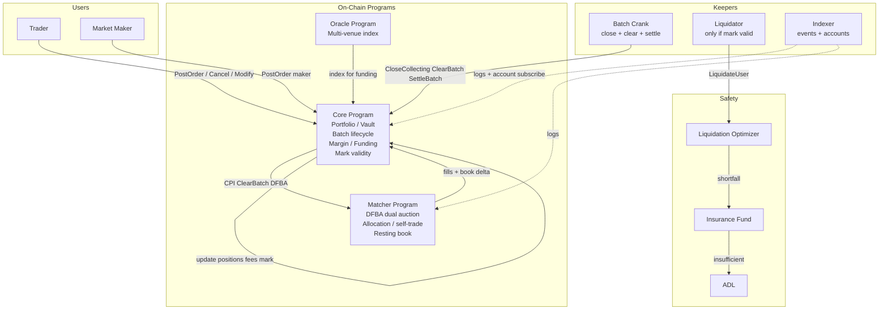

# On-Chain Perpetuals DEX Design

> **Aligned with** `docs/ai/requirements/2026-06-18-feature-onchain-perps-dex.md` (DFBA Decision Log, 2026-08-02).  
> **Supersedes** commit-reveal, Fisher-Yates shuffle, structural priority queues, reveal relayer, and freshness-based mark blend.  
> Historical RFQ/continuous alternative remains at `feature-onchain-perps-dex-rfq.md` (not active v1).

## Architecture Overview

A fully on-chain perpetual futures exchange on Solana using a **Dual Flow Batch Auction (DFBA)** matching engine. Every post, cancel, dual-auction clear, fill, and settlement is verifiable on-chain. There is no sequencer and no commit-reveal ceremony.

**Market structure (normative):**

1. Traders **post** limit orders in the clear during a governance-parameterized collection window (`is_maker` flag; default taker).
2. A permissionless crank **closes** the window and runs **two independent uniform-price auctions**:
   - **Bid auction:** maker-buy × taker-sell  
   - **Ask auction:** maker-sell × taker-buy  
3. Each auction maximizes matched volume at a single clearing price; allocation is price-priority then pro-rata at the margin; self-trades excluded.
4. Unfilled quantity **rests** with the same maker/taker role (full DFBA rest). Immediate cancel/modify allowed outside clear.
5. **Mark** = mid(bid_clear, ask_clear) only when **both** auctions produce a usable clear; otherwise liquidations pause. Multi-venue oracle is **index/funding only**.



**Key principles**

| Principle | Design rule |
|-----------|-------------|
| Custody isolation | Core alone moves SOL; matcher never holds funds |
| Structural fairness | No within-batch time priority; dual uniform clears; makers never match makers |
| Mark purity | Execution and mark from DFBA only; oracle never sets mark |
| CU honesty | Hard per-batch order cap; single-ix clear; mgk-owned CU spike gates the cap |
| Safety | Liquidations require valid dual-clear mark; pause flags independent |

### Why not continuous CLOB / commit-reveal

| Approach | Rejection for v1 |
|----------|------------------|
| Continuous price-time CLOB | Latency arms race, leader reordering, adverse selection for makers |
| Commit-reveal + CLOB clear | Hides intent but still CLOB economics after reveal; two-tx UX + relayer |
| Off-chain DFBA solver | Reintroduces trust/MEV surface |
| Hybrid continuous + DFBA | Scope explosion; pure DFBA only |

## Key Components & Responsibilities

### Core Program (`mgk-perps-core`)

- Portfolio / deposit / withdraw (SOL vault PDA)
- Batch lifecycle: **Collecting → Clearing → Settled** (then next Collecting)
- Order post path: margin check, lock free collateral for worst-case, CPI or book-owner place on matcher book
- Immediate cancel / modify resting orders
- Clear orchestration: CPI to matcher with book + eligible orders; apply fill receipts to positions
- Settle: fees, funding accrual, open next batch, persist mark / `liq_paused`
- Liquidation path (gated on valid mark)
- Pause flags, governance params, instrument registry

### Matcher Program (`mgk-perps-matcher`)

- Persistent resting book (four logical legs for DFBA: maker-buy, maker-sell, taker-buy, taker-sell — or two sides × role flag)
- **DFBA clear:** collect under cap → dual `compute_clearing` → single `compute_allocation` → fill receipts (no double recompute)
- Self-trade prevention (same portfolio cannot fill against itself)
- Does **not** hold funds; returns `FillReceipt[]` + book mutations
- Stack discipline: `#[inline(never)]`, fixed scratch, unit-tested buffer layout

### Oracle (`mgk-oracle` + multi-venue index)

- Multi-venue fair value for **index** used in funding only
- Optional admin fallback for index when multi-venue stale (does **not** become mark)
- Freshness checks on index reads for funding; never used to set mark or as sole liquidation mark

### Keepers

| Role | Duty | Incentive |
|------|------|-----------|
| Batch crank | Close collecting when window criteria met; clear; settle | Share of taker fees (~10% of batch taker fees, governance) |
| Liquidator | Call `LiquidateUser` when mark valid and portfolio under MM | ~2.5% of liquidated notional |
| Index oracle keeper | Post multi-venue index | Keeper fee / ops |
| Indexer | Parse events + account state | Off-chain product |

**Removed:** pre-signed reveal relayer (no commit-reveal).

### Safety stack

Unchanged structure: liquidation optimizer → insurance fund (base/quote inventory) → ADL.  
**Gate:** `LiquidateUser` rejects if `!mark_valid` (no dual clear this settled batch / no valid DFBA mid). Trading and cancels may continue when `liq_paused`.

## Batch Lifecycle

```
     PostOrder / Cancel / Modify
              │
              ▼
   ┌──────────────────┐   close_collecting    ┌─────────────┐   clear_batch    ┌──────────┐
   │   COLLECTING     │ ───────────────────► │  CLEARING   │ ───────────────► │ SETTLED  │
   │  open posts      │   (permissionless     │  DFBA dual  │  settle_batch    │ mark set │
   │  full rest book  │    crank when window) │  auction    │                  │ next open│
   └──────────────────┘                       └─────────────┘                  └──────────┘
```

### Collecting

- Status `Collecting`. Users post limit orders with `is_maker` (default **false** = taker), side, price, qty, reduce_only.
- Resting book already holds unfilled makers/takers from prior batches.
- Immediate `CancelRestingOrder` / `ModifyRestingOrder` allowed (if trading not paused).
- Window closes when **dynamic criteria** met (permissionless `CloseCollecting`):

| Parameter | Default (design) | Notes |
|-----------|------------------|-------|
| `t_batch_min_slots` | 1 | Earliest close |
| `t_batch_target_slots` | 2 | Default ~0.8s at 400ms slots |
| `t_batch_max_slots` | 4 | Force close |
| `n_min_orders` | 0 | Optional; 0 = time-only |

Close rule: `(slot_age >= t_batch_min AND (n_orders >= n_min_orders OR n_min_orders == 0)) OR slot_age >= t_batch_max`.

### Clearing

- Crank calls `ClearBatch` (may be one ix or core+matcher CPI pair in one tx).
- Matcher:
  1. **Select** up to `per_batch_order_cap` orders per auction side pair under § Overflow rule  
  2. **Bid auction** then **ask auction** (or simultaneous in one pass): volume-max uniform price  
  3. **Allocate** once; emit fill receipts  
  4. **Update** resting qty; fully filled orders removed  
- Core applies receipts: positions, fees, free collateral unlock/relock.

### Settled

- Persist `last_bid_clear`, `last_ask_clear`, `matched_bid_qty`, `matched_ask_qty`
- If both clears usable: `mark = (bid_clear + ask_clear) / 2`, `mark_valid = true`, `liq_paused = false`
- Else: `mark_valid = false`, `liq_paused = true` (trading continues unless trading paused)
- Accrue funding using mark (if valid) vs index (if fresh); else skip/hold per § Funding
- Open next batch (`batch_id++`, status Collecting)

## DFBA Matching Algorithm

### Roles

- **Maker** (`is_maker = true`): provides liquidity; free of taker fee in v1.
- **Taker** (`is_maker = false`, default): seeks immediacy; pays `taker_fee_bps` on filled notional at clear price.
- Role is **user-designated**, not arrival-time.

### Bid auction (maker-buy × taker-sell)

- Sort maker buys descending price; taker sells ascending price (price priority).
- Two-pointer merge: cross when `maker_price >= taker_price`.
- Choose uniform `clearing_price` maximizing matched base qty (DFBA paper semantics).
- All fills at `clearing_price`.

### Ask auction (maker-sell × taker-buy)

- Symmetric: cross when `maker_price <= taker_price`.

### Allocation

1. Fill better-than-clear prices fully (price priority).  
2. At marginal price: **pro-rata by size**, each order fill `min(remaining, pro_rata_share, marginal_size_cap)`.  
3. **Round down** fractional pro-rata; residual dust unmatched (protocol; non-extractable).  
4. **Self-trade:** skip pairs where maker and taker resolve to the same portfolio PDA; do not fill either leg against each other (re-run residual against next eligible counterparty or leave unmatched).  
5. Conservation: `sum(maker fills) == sum(taker fills) == matched_qty - dust`.

### Overflow / per-batch cap (D2, D8)

- `per_batch_order_cap` (default **64**, governance; max **128** for scratch sizing) bounds **eligible orders per clear instruction** for the combined dual-auction work.
- **Selection:** include orders by **price priority** (best prices first for their side/role).  
- **Tie-break:** larger size first, then lower `order_id`.  
- Excluded orders **remain resting** for the next batch (not cancelled).
- Cap = 0 is invalid (clear rejects).

### Marginal size cap (anti size-inflation)

- Governance `marginal_size_cap` (base lots). Default **equal to no extra cap** (`u64::MAX` meaning “order size only”) — but **must not** be silently ignored in code; tests cover both capped and uncapped modes.
- When set finite: each marginal-level order fill ≤ `min(order_remaining, marginal_size_cap)`.

### Scratch / CU (engineering)

- Flat pack for clear: fixed record width (document once), e.g. `{ price: i64, size: u64, order_id: u64, portfolio: Pubkey or seat_idx }`  
- Four regions: maker_buy | maker_sell | taker_buy | taker_sell  
- **Unit-test region offsets** before any portfolio write  
- `#[inline(never)]` on clear entry; fixed `MaybeUninit` scratch; no large stack arrays  
- CU gate: mgk spike must show full dual clear + alloc + receipt encode ≤ comfort target at configured cap (target **≤ ~200k CU** comfort for clear path alone where possible; hard **≤ 1.4M** for whole tx)

## Mark, Index, Funding

### Mark (pure DFBA)

```
if bid_auction.matched_qty > 0 AND ask_auction.matched_qty > 0:
    mark = (bid_clearing_price + ask_clearing_price) / 2
    mark_valid = true
else:
    mark_valid = false
    // mark field retains last valid mid for display only; NOT used for liq
```

**D6 locked:** only the **current** settled batch’s dual clear validates mark. No “last mid for N slots” for liquidations in v1.

### Index

- Multi-venue aggregated fair value (4 CEX venues), nonce-sequenced posts.
- Used **only** for funding index and UI reference — never mark, never liquidation mark.

### Funding (D7)

- When `mark_valid` and index fresh (`slot_age <= max_index_staleness_slots`):  
  `funding_rate = clamp( (mark - index) / index * k , -max_rate, +max_rate )` over `funding_interval_slots`  
- When index stale: **skip funding accrual** this interval (positions unchanged); trading continues.  
- When `!mark_valid`: **skip funding accrual** (no auction mid).  
- Checked i128 math; protocol-favorable rounding on fee legs.

## Data Models

### Portfolio (Core) — retained shape

```rust
struct Portfolio {
    user: Pubkey,
    equity: i128,
    principal: i128,
    pnl: i128,
    im: u128,
    mm: u128,
    free_collateral: i128,
    health: i128,
    positions: [Position; MAX_POSITIONS],
    last_funding_checkpoint: [i128; MAX_INSTRUMENTS],
    open_order_count: u16,
    last_batch_id: u64,
    last_slot: u64,
    // ...
}

struct Position {
    instrument_id: u16,
    qty: i64,          // signed base
    entry_vwap: i64,
}
```

### Batch (Core) — DFBA

```rust
struct Batch {
    batch_id: u64,
    status: BatchStatus,           // Collecting | Clearing | Settled
    collecting_opened_slot: u64,
    close_slot: u64,
    order_count: u32,
    per_batch_order_cap: u32,      // snapshot of governance at open (optional)
    last_bid_clearing_price: i64,
    last_ask_clearing_price: i64,
    matched_bid_qty: u64,
    matched_ask_qty: u64,
    mark_price: i64,               // mid if valid else 0 or last display
    mark_valid: bool,
    liq_paused: bool,
    total_fills: u32,
    total_taker_fees: u64,
    // removed: reveal deadlines, shuffle_seed, commitment counters, slash totals
}

enum BatchStatus {
    Collecting = 0,
    Clearing = 1,
    Settled = 2,
}
```

### Resting order (Matcher book)

```rust
struct RestingOrder {
    order_id: u64,
    user: Pubkey,              // portfolio owner
    instrument_id: u16,
    side: Side,                // Buy | Sell
    is_maker: bool,
    price: i64,
    qty: u64,
    filled_qty: u64,
    reduce_only: bool,
    batch_placed: u64,
    // book linkage...
}
```

Book remains price-ordered per side; **role flag** partitions legs for dual auction without requiring four separate books (implementation may use two books + flag or four lists).

### Instrument

```rust
struct Instrument {
    instrument_id: u16,
    // ... tick/lot/IMR/MMR ...
    taker_fee_bps: u16,        // default 5
    maker_fee_bps: i16,        // 0 in v1 (no rebate required)
    // multi-venue index account address / feed id
    cum_funding: i128,
    last_funding_ts: i64,
    funding_interval_slots: u64,
    is_active: bool,
}
```

### Registry / governance params (new or extended)

```rust
struct BatchParams {
    t_batch_min_slots: u16,      // 1
    t_batch_target_slots: u16,   // 2
    t_batch_max_slots: u16,      // 4
    n_min_orders: u32,           // 0
    per_batch_order_cap: u32,    // 64
    marginal_size_cap: u64,      // u64::MAX = order-size only
    taker_fee_bps_default: u16,  // 5
    max_index_staleness_slots: u64,
}
```

### Removed from v1 design

- `Commitment` PDA and slash lifecycle  
- `RevealedOrder` intermediate  
- Fisher-Yates shuffle state  
- Structural priority queues (cancels/ALO/regular for batch match)  
- `FlowQualityScore` (toxic-taker deferred)  
- Reveal relayer  

### Fill receipt (CPI result)

```rust
struct FillReceipt {
    order_id: u64,
    user: Pubkey,
    instrument_id: u16,
    side: Side,
    is_maker: bool,
    fill_qty: u64,
    fill_price: i64,       // auction clearing price
    fee_paid: u64,         // 0 for makers
    auction: AuctionSide,  // Bid | Ask
}
```

## API / Interface Contracts

### Core instructions (v1 target)

| Disc | Instruction | Notes |
|------|-------------|--------|
| `0` | Initialize | Registry |
| `1` | InitPortfolio | |
| `2` | Deposit | |
| `3` | Withdraw | Margin check |
| `4` | **PostOrder** | Replaces Commit+Reveal. Args: instrument, side, price, qty, `is_maker`, reduce_only |
| `5` | **CloseCollecting** | Permissionless; was CloseCommitting |
| `6` | **ClearBatch** | Permissionless; CPI DFBA clear |
| `7` | **SettleBatch** | Funding, mark, open next |
| `8` | LiquidateUser | Requires `mark_valid` |
| `9` | AddInstrument | Governance |
| `A` | CancelRestingOrder | Immediate |
| `B` | ModifyRestingOrder | Immediate; margin re-check |
| `C` | CancelAllRestingOrders | |
| `D` | SetPauseFlags | trading / withdraw / liq / funding / clear / post |
| `E` | SetBatchParams | Governance |
| `F` | PostMultiVenuePrice | Or on oracle program — index only |

**Retired:** CommitOrder, RevealOrder, slash-on-miss-reveal.

### Matcher instructions

| Disc | Instruction | Notes |
|------|-------------|--------|
| `0` | **DfbaClearAndMatch** | Dual auction + allocate + book update; returns fill receipts |
| `1` | PlaceResting | Called via core on post |
| `2` | CancelResting | |
| `3` | ModifyResting | |

### Pause flags

Independent bits: `PAUSE_POST`, `PAUSE_CLEAR`, `PAUSE_WITHDRAW`, `PAUSE_LIQUIDATE`, `PAUSE_FUNDING`, `PAUSE_TRADING` (umbrella if needed).  
No reveal-specific flag.

### Auth

- User signer: post / cancel / modify / deposit / withdraw  
- Permissionless: close / clear / settle / liquidate / post index (registered keepers for index)  
- Governance: params, pause, instruments  

## Events & Indexer (data pipeline)

> Aligns with data-pipeline skill non-negotiables: idempotent writes, slot on every row, backfill path.

### Events (program logs / self-CPI buffer)

| Event | Fields (min) |
|-------|----------------|
| `OrderPosted` | batch_id, order_id, user, instrument, side, is_maker, price, qty, slot |
| `OrderCancelled` / `OrderModified` | order_id, user, new_qty, slot |
| `BatchClosed` | batch_id, close_slot, order_count |
| `BatchCleared` | batch_id, bid_clear, ask_clear, matched_bid_qty, matched_ask_qty, mark, mark_valid, liq_paused, slot |
| `Fill` | batch_id, order_id, user, auction, fill_qty, fill_price, is_maker, fee, slot |
| `BatchSettled` | batch_id, next_batch_id, slot |
| `FundingAccrued` / `FundingSkipped` | instrument, rate or reason, slot |
| `Liquidation` | user, reductions…, slot |
| `LiqPaused` | instrument or global, reason, slot |

### Indexer design

| Choice | v1 |
|--------|-----|
| Ingestion | WebSocket `logsSubscribe` / `onLogs` on core+matcher program IDs; optional accountSubscribe on Batch + Book PDAs |
| Storage | SQLite (existing mgk indexer) or Postgres later |
| Idempotency | Unique key `(signature, event_index)` or `(slot, tx_index, log_index)` |
| Backfill | Slot-range getSignaturesForAddress + reparse |
| Queries | Latest mark/mark_valid, dual clear prices, order book by role, fills, portfolio |

**Do not** rely on enhanced third-party “SWAP” parsers for DFBA — custom decode of single-byte discriminators.

## Component Breakdown

| Layer | Path | DFBA change |
|-------|------|-------------|
| Core batch state | `programs/perps-core/src/state/batch.rs` | Collecting/Clearing/Settled; dual clear fields; drop reveal |
| Core instructions | `commit_order` / `reveal_order` → `post_order` | Rewrite |
| Clear path | `clear_batch.rs` + matcher CPI | DFBA dual auction |
| Matcher | `shuffle.rs`, `queue.rs`, CLOB walk → `dfba_clear.rs` | Replace match core |
| Mark | `mark_price.rs` | Pure mid; liq gate |
| Book | `book.rs` | Persist role flag; price-ordered |
| Frontend / SDK | follow-on | Single-tx post; show bid/ask clear + mark_valid |
| Indexer | `mgk-frontend/apps/indexer` | New events |

## Design Decisions

### Product decisions (from requirements — locked)

| # | Decision | Choice |
|---|----------|--------|
| A | Collection | Open posts; no commit-reveal |
| 2 | Roles | User-designated; default taker |
| 3 | Cadence | Governance window; defaults below |
| 4 | Rest | Full DFBA rest |
| 5 | Depth | Hard cap; single-ix clear |
| 6–7 | Mark | Dual mid only; else liq pause |
| 8 | Oracle | Index/funding only |
| 9 | Fees | Taker flat bps; maker free |
| 10 | Cancel/modify | Immediate |
| 11 | Toxic-taker | Deferred |
| 13 | Self-trade | Prevent |

### Design parameters settled (D1–D10)

| ID | Parameter | Choice | Rationale |
|----|-----------|--------|-----------|
| D1 | Batch slots | min=1, target=2, max=4 | Near-slot UX; room under congestion |
| D2 | `per_batch_order_cap` | **64** default (max 128 scratch) | CU headroom until mgk spike; raise only after measured |
| D3 | `taker_fee_bps` | **5** default | Simple; governance-tunable |
| D4 | Dust | Round-down-to-protocol | Conservation; non-extractable |
| D5 | State machine | Collecting → Clearing → Settled | Minimal |
| D6 | Mark validity | **Current dual clear only** | Matches requirements product intent |
| D7 | Funding | mark vs index; skip if !mark_valid or index stale | Safe |
| D8 | Overflow | Best price first; size; order_id | Explicit, fair |
| D9 | Events | BatchCleared + Fill + mark_valid | Indexer-ready |
| D10 | Migration | Retire commit/reveal; rewrite matcher clear; keep portfolio/vault/liq stack | Incremental where safe |

### Alternatives considered (design)

| Topic | Options | Chosen |
|-------|---------|--------|
| Clear location | All in core vs matcher CPI | **Matcher CPI** — keeps custody isolation; heavy math off vault program |
| Cap unit | Per side vs global | **Global cap on clear work** with price-priority selection across legs |
| IOC takers | Default IOC vs full rest | **Full rest** (requirements) |
| Last-good mark for liq | N-slot grace | **Rejected** for v1 |

### Security (DeFi checklist applied)

- Checked arithmetic on all notional, fee, funding, margin paths  
- Rounding: fees round up to protocol; pro-rata fills round down; dust stays unmatched  
- Slippage: every order has limit price enforced at clear (taker/maker limits)  
- Checks-effects-interactions on CPI: book/fill effects before any external interaction; core applies fills after matcher returns  
- Account owner + signer validation on every ix  
- Emergency pause (post/clear/withdraw/liq/funding)  
- Liquidations cannot run on invalid mark (oracle manipulation of mark removed by design)  
- Index freshness for funding only — stale index does not invent mark  
- Formal targets: conservation, makers-only-match-takers, uniform price bound, self-trade free, mark_valid ⇒ dual clear  

## Non-Functional Requirements

| Area | Target |
|------|--------|
| Clear CU | Dual clear+alloc at cap=64 within measured budget; document spike results |
| Stack | Zero SBF stack overflow at build |
| Latency | Collection target ~1–2 slots; p50/p99 crank lag measured on devnet |
| Availability | Permissionless crank; missed slot → next slot |
| Indexer lag | Sub-500ms p99 query for latest batch/mark when RPC healthy |
| Tests | Unit DFBA paper example vectors; allocation pro-rata; self-trade; cap overflow; mark/liq gate; conservation |

## Requirements Coverage Matrix

| Requirements goal / story | Design coverage |
|---------------------------|-----------------|
| Fully on-chain DFBA | § DFBA Matching + lifecycle |
| No commit-reveal | Retired ix; PostOrder |
| User maker/taker default taker | RestingOrder.is_maker; PostOrder args |
| Full rest | Unfilled remain on book |
| Dual uniform clears | Bid/ask auctions |
| Pure DFBA mark + liq pause | § Mark; LiquidateUser gate |
| Index/funding only oracle | § Funding; oracle role |
| Hard order cap | D2 + overflow rule |
| Immediate cancel/modify | Core ix A/B |
| Taker fee / maker free | Instrument fees + FillReceipt |
| Self-trade prevention | Allocation step 4 |
| Insurance inventory | Safety stack retained |
| Pause flags | SetPauseFlags bits |
| CU / stack lessons | Scratch + CU gate + buffer tests |
| Indexer dual clear | § Events & Indexer |
| Toxic-taker | Explicitly out (deferred) |
| Frontend dual-sign | Out — frontend feature follow-on |

## Migration Notes (implementation)

1. Freeze new commit-reveal features.  
2. Add `PostOrder` + book role flag alongside or replacing commit path.  
3. Implement `dfba_clear` in matcher; feature-flag or replace `ShuffleAndMatch`.  
4. Rewrite batch status machine; migrate account layouts carefully (version byte).  
5. Update SDK encoders; drop reveal relayer.  
6. Run CU spike; adjust `per_batch_order_cap`.  
7. Update indexer events; backfill optional.  

## Open items (non-blocking for design approval)

| Item | Owner |
|------|--------|
| Exact CPI account list / remaining accounts layout for ClearBatch | Implementation |
| Precise funding `k` and clamp constants | Governance + implementation |
| Whether PostOrder is core-only with matcher CPI place, or two client ixs | Implementation (prefer one user tx) |
| Display mark when !mark_valid (last mid vs blank) | Frontend follow-on |

## See also

- Requirements: `docs/ai/requirements/2026-06-18-feature-onchain-perps-dex.md`  
- DFBA paper: https://jumpcrypto.com/resources/dual-flow-batch-auction  
- Engineering lessons: requirements § On-chain DFBA engineering lessons  
- Historical: this file’s pre-2026-08-02 commit-reveal design (replaced in place)  
- RFQ alternative (inactive): `feature-onchain-perps-dex-rfq.md`  
